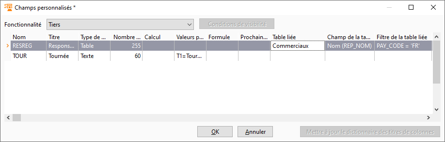
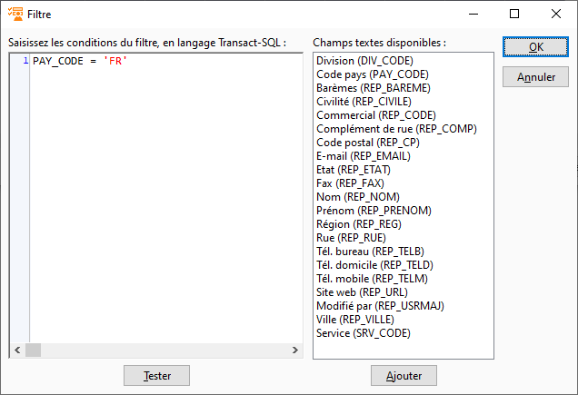
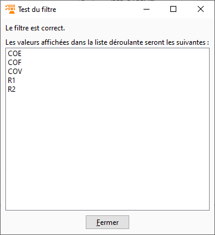

# Liste déroulante avec les valeurs d'une table

Il est possible de créer une liste déroulante permettant de choisir 
 parmi les valeurs d'une table de la base de données.

 

Par exemple, le champ personnalisé ci-dessous de type "Table", 
 affiche dans les tiers, une liste déroulante pour choisir un commercial.

 

 

En complément, un filtre peut être paramétré. Par exemple, le filtre 
 ci-dessous permet de limiter la liste aux commerciaux dont le code pays 
 est "FR" :

 

 

 

Le bouton "Tester" permet de vérifier la validité du filtre 
 : 

 

