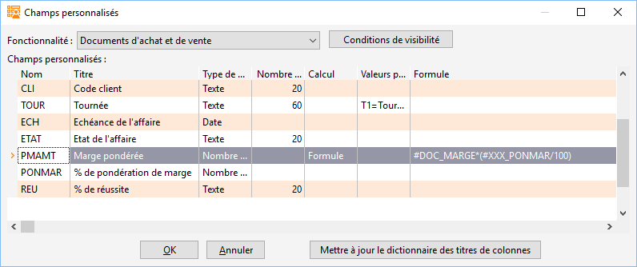

# Champs personnalisés calculés


Les formules de calcul sont applicables à différents 
 types de champs utilisateurs. Le type de champ doit correspondre au type 
 d’information du résultat du calcul.


 


Exemple : concaténation de 2 champs textes, 
 le résultat étant un texte, le type à choisir pour le champ ayant la formule 
 est texte.


 


Pour définir une formule, il faut sélectionner 
 "Formule" dans la colonne "Calcul" du champ utilisateur 
 puis saisir la formule dans la colonne "Valeurs possibles ou formule 
 ou prochain compteur".


 


 





 


La syntaxe des formules est la même que pour 
 les frais d’approches :


* # + Nom d'un champ
* $ + Nom d'une constante numérique
* Opérateurs : +, -, /, \*
* Parenthèses.


 


Seuls sont utilisables dans une formule les champs de la table dans 
 laquelle est ajouté le champ utilisateur. Les autres champs utilisateurs 
 de la table (non calculés) sont utilisables.


 


L’opération est effectuée lors de l’enregistrement de la fiche, ou le 
 passage à une autre ligne (pour les champs calculés présent dans des grilles 
 de saisie (lignes de document, Écriture, etc.).


 


Le résultat n’est pas modifiable.


 


Lors de l’insertion de champs calculés dans une table, les calculs ne 
 se feront pas de manière rétroactive.


 


Les fonctions suivantes sont utilisables :


## Fonctions logiques


| Nom | Description |
| Case(Index, Result1, Result2, ... )  |   |
| If(Value, If\_True\_Result, If\_False\_Result) |   |


## Fonctions mathématiques


| Nom | Description |
|---|---|
| Abs(Value) | Retourne la valeur absolue du nombre |
| Distance(X1, Y1, X2, Y2) | Retourne la distance en pixels entre 2 points, par la formule 
 de Taylor |
| Factorial(Value) | Retourne la factorielle du nombre |
| Frac(Value) | Retourne la partie décimale du nombre 
 Par exemple : Frac(10.5) retourne 0.5 |
| Interpolate(Position, Value1, Distance1, Value2, Distance2) |   |
| IntPower(Base, Exponent) | Retourne la multiplication du nombre par lui même répétée N 
 fois |
| ln(Value) | Retourne le logarithme népérien du nombre |
| log10(Value) | Retourne le logarithme en base 10 du nombre |
| logN(Base, Value) | Retourne le logarithme en base N du nombre |
| Max(Value1, Value2, ...) | Retourne le plus grand des nombres |
| Min(Value1, Value2, ...) | Retourne le plus petit des nombres |
| Odd(Value) | Retourne vrai si le nombre est impair |
| Pi | Retourne la valeur du nom Pi |
| Power(Value, N) | Retourne la multiplication du nombre par lui même répétée N 
 fois |
| Round(Value) | Retourne l'arrondi du nombre à l'entier le plus proche. <br>Si le nombre se trouve à mi chemin entre les deux nombres entiers les plus proches, alors le résultat sera le nombre entier pair le plus proche. |
| Sqr(Value) | Retourne le carré du nombre |
| Sqrt(Value) | Retourne la racine carré du nombre |
| Trunc(Value) | Retourne la partie entière du nombre |


## Fonctions textes


| Nom | Description |
|---|---|
| Copy(Text\_Value, StartIndex, Count) | Retourne une partie de la chaîne de caractères |
| FloatToText(Value) | Transforme le nombre à virgule en chaîne de caractères |
| IntToText(Value) | Transforme le nombre entier en chaîne de caractères |
| Length(Text\_Value) | Retourne la taille de la chaîne de caractères |
| LowerCase(Text\_Value) | Retourne la chaîne de caractères en minuscules |
| Pos(SubText, Text\_Value) | Retourne l'index de la première occurrence de la sous-chaîne dans la chaîne de caractères |
| PosEx(SubText, Text\_Value, Offset) | Retourne l'index de la première occurrence d'une sous-chaîne dans la chaîne de caractères |
| TextToFloat(Text\_Value) | Transforme la chaîne de caractères en nombre à virgule |
| TextToFloatDef(Text\_Value, DefaultResult) | Transforme la chaîne de caractères en nombre à virgule avec la possibilité de passer une valeur par défaut en cas d'erreur |
| TextToInt(Value) | Transforme la chaîne de caractères en nombre entier |
| TextToIntDef(Value, DefaultResult) | Transforme un chaîne de caractères en nombre entier  avec la possibilité de passer une valeur par défaut en cas d'erreur |
| Trim(Text\_Value) | Supprime les espaces de début et de fin de la chaîne de caractère |
| UpperCase(Text\_Value) | Retourne la chaîne de caractères en majuscules |


## Fonctions trigonométriques


| Nom | Description |
|---|---|
| ArcCos(Value) | Retourne le cosinus inverse de la valeur |
| ArcCosh(Value) | Retourne le cosinus hyperbolique inverse de la valeur |
| ArcSin(Value) | Retourne le sinus inverse de la valeur |
| ArcSinh(Value) | Retourne le sinus hyperbolique de la valeur |
| ArcTan2(Y, X) | Retourne l'angle et le quadrant d'arc-tangente de la valeur |
| ArcTanh(Value) | Retourne la tangente hyperbolique inverse de la valeur |
| Cos(Value) | Retourne le cosinus en radians de la valeur |
| Cosh(Value) | Retourne le cosinus hyperbolique de l'angle |
| DegToRad(Value) | Convertit des degrés en radians |
| RadToDeg(Value) | Convertit des radians en degrés |
| Sin(Value) | Retourne le sinus en radians d'une valeur  |
| Sinh(Value) | Retourne le sinus hyperbolique d'un angle |
| Tan(Value) | Retourne la tangente de la valeur |
| Tanh(Value) | Retourne la tangente hyperbolique de la valeur |


## Exemples


Copy(#PCF\_CP, 1, 2)


Renvoie les 2 premiers caractères du code postal.


 
```
If((#PAY\_CODE = "FR") and (#FAT\_CODE = "FA3"), 
 "A traiter", "")
```

Condition qui vérifie le code et le code famille du tiers et qui renseigne 
 un texte quand ces 2 codes ont la valeur "FR" et "FA3".


