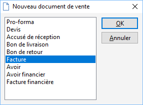

# Champs personnalisés obligatoires

Les champs personnalisés des documents d'achat et de vente, peuvent être rendus "Obligatoire" c’est-à-dire que l'utilisateur sera obligé de renseigner le champ avant enregistrement d’un document.

## Paramétrage

Allez dans les champs personnalisés (SOCIETE | Paramétrage | Champs personnalisés)

 

 

Allez dans "Documents d’achat et de vente"

 

 

Mettez-vous sur le champ personnalisé que vous souhaitez rendre obligatoire puis dans l’onglet "obligatoire" renseignez "Oui, message bloquant" et enfin insérez un "message bloquant ou informatif". Terminez par "OK".

 

## Utilisation

Créez une nouvelle facture (ventes – Nouveau document de vente)

 

 

Insérez un "client" puis un "article" et faites "Enregistrer". Le message de type bloquant (obligatoire) apparaîtra et obligera le salarié à renseigner ce champ personnalisé

 

