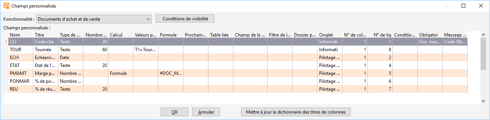
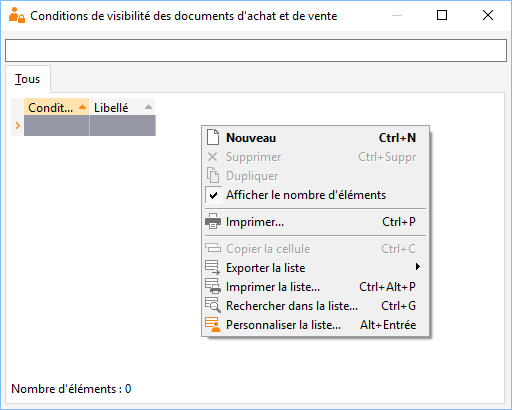
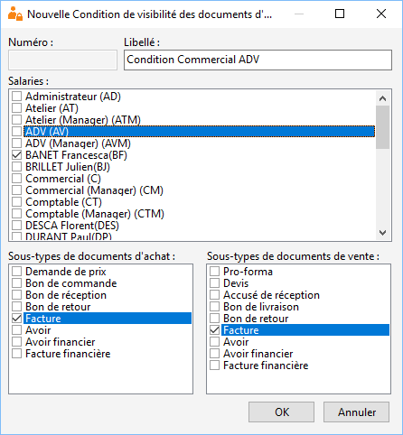
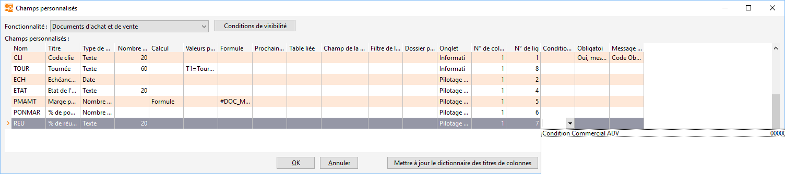
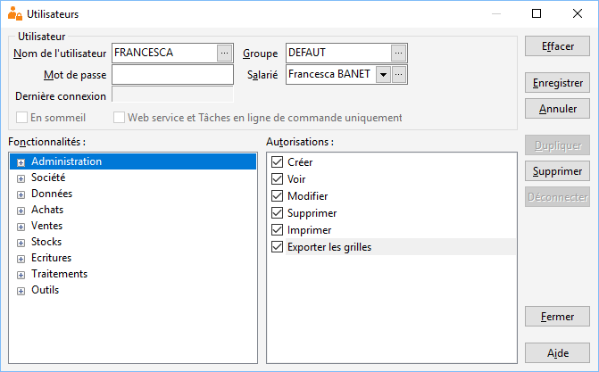
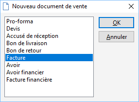
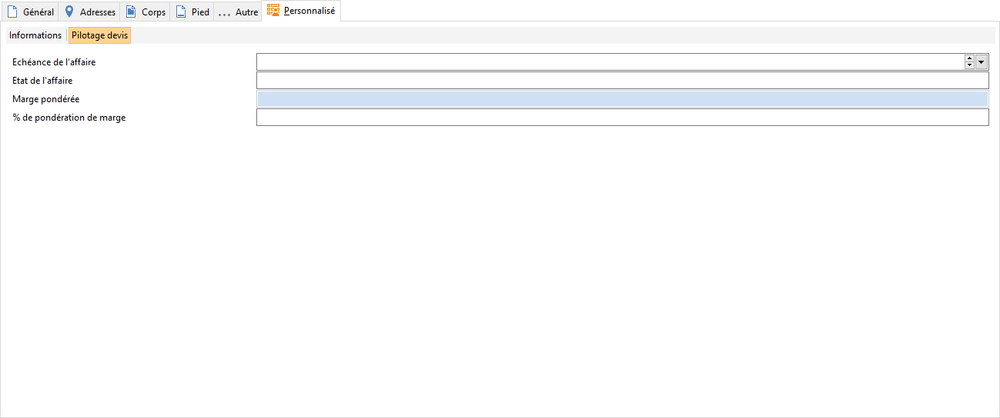

# Conditions de visibilité

Les conditions de visibilité permettent d’afficher ou non un champ personnalisé 
 avec un caractère obligatoire selon plusieurs critères.

## Paramétrage

Allez dans les champs personnalisés (SOCIETE 
 | Paramétrage | Champs personnalisés)

 

  

Allez dans "Documents d’achat et de vente"

 

 

Cliquez en haut sur "Conditions de visibilité"

 

  

Une fenêtre s’ouvre puis faites clic droit "Nouveau"

 

 
  
Une nouvelle "Condition de visibilité" 
 est disponible à la création.

 

Il existe trois différents critères :

* Salariés : le 
 champ personnalisé ne sera visible que pour les salariés sélectionnés, 
 si un caractère obligatoire est sélectionné, alors le message à caractère 
 obligatoire sera effectif uniquement pour ces salariés.
* SousTypes de 
 documents d’achat : le champ personnalisé ne sera visible que pour 
 les sous-types de documents d’achats sélectionnés, si un caractère 
 obligatoire est sélectionné, alors le message à caractère obligatoire 
 sera effectif uniquement pour ces sous-types de documents d’achats.
* SousTypes de 
 documents de ventes : le champ personnalisé ne sera visible que pour 
 les sous-types de documents de ventes sélectionnés, si un caractère 
 obligatoire est sélectionné, alors le message à caractère obligatoire 
 sera effectif uniquement pour ces sous-types de documents de ventes.

 

Exemple : Mon champ personnalisé ne sera visible 
 que pour Francesca BANET pour les factures de vente et d’achat. (Puis 
 faites "OK").

 

 
  
Une fois validé, créez un champ personnalisé 
 ou vous allez y affecter votre nouvelle "condition de visibilité" 
 puis en bas faites "OK".

 

Attention : pour que les conditions 
 de visibilité fonctionnent il faut que votre salarié soit rattaché à un 
 utilisateur (SOCIETE/Utilisateurs)

 

## Utilisation

Connectez-vous à Gestimum avec l’utilisateur 
 à qui vous avez affecté la condition de visibilité

 

Créez une nouvelle facture (VENTES/Nouveau document 
 de vente)

 

 

Sur votre facture, allez dans l’onglet "Champs 
 personnalisés" et à cet endroit vous pourrez voir le champ créé avec 
 la condition de visibilité.

 

 
 
  
Si vous faites, par exemple, un devis ce champ 
 "% de réussite" n'apparaîtra pas car au préalable paramétré 
 visible que sur les factures.

 

 
 
  
Pour en savoir plus sur les [champs 
 personnalisés à caractère obligatoire.](../5/ChampsPersonnalisesObligatoires.md)

