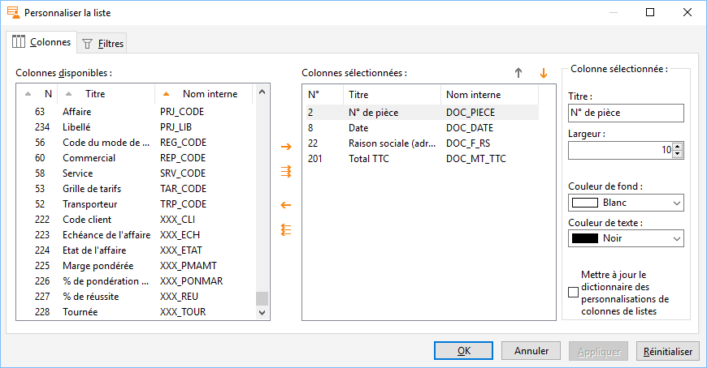

# Champs personnalisés dans les personnalisations de listes

## Préfixe

Les champs personnalisés sont disponibles dans les personnalisations 
 de listes, et identifiés par la préfixe "XXX\_" dans le nom interne 
 des champs.

## Exemple

