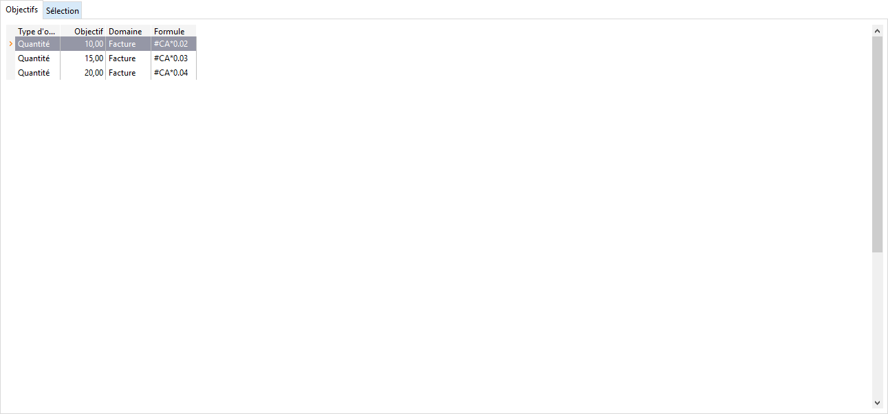

Objectifs

Une ligne d’objectif est décrite par son type, son seuil, son domaine et sa formule de calcul. La création ou la suppression d’une ligne d’objectif est possible à partir du menu contextuel.

 

# Type d’objectif

Un objectif peut être défini sur la marge, le chiffre d’affaires réalisé ou la quantité.

Tous les objectifs d’un même barème doivent obligatoirement être de même type.

Attention, le type Quantité ne peut être utilisé pour un domaine d’application Encaissement ou Échéances.

# Objectif

Il représente un seuil (quantité ou montant) à partir duquel l’objectif s’applique. Une limite supérieure éventuelle se paramètre dans une autre ligne d’objectif.

# Domaine

Le domaine sert à définir à partir de quel moment la commission déterminée par l’objectif est applicable :

* à la commande,
* à la livraison,
* à la facturation,
* à l’encaissement,
* à la date des échéances.

# Formule de calcul

La commission rétribuant un objectif atteint est soit un montant fixe, soit un montant calculé à partir d’une formule de calcul.

Pour renseigner une formule de calcul, les éléments suivants sont à votre disposition :

* Le nom d’une variable en majuscule (CA, Q pour Quantité, MARGE, ENCAISSE), précédés du signe #

La variable #ENCAISSE s’utilise uniquement sur un domaine Encaissement,

* Les opérateurs suivants: +, , /, \*,
* Les constantes numériques paramétrées dans les tables (précédées du signe $).

Exemple de formule sur un objectif sur chiffre d’affaires :

10 % Du chiffre d’affaires : #CA\*0. 10

