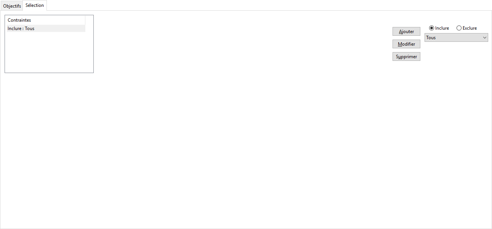

Sélection

Un barème s'articles pour lesquels l’option Hors commission n’est pas 
 cochée dans la [fiche article](../2/OngletAutre.htm) 
 et pour la totalité (Condition Tous) ou une sélection de tiers. Cette 
 sélection se définit en incluant ou excluant tel ou tel article, famille, 
 tiers, sous-famille, famille d’article ou famille de tiers.

 

 

Exemple :

Prenons des pots de peinture regroupés dans une famille Peinture et 
 pour lesquels vous distinguez les peintures Intérieures et Extérieures 
 grâce aux sous-familles.

 

Pour commissionner un commercial sur tous les articles appartenant à 
 la famille Peinture à l’exception des Peintures Extérieures, vous devez 
 créer une condition de type Inclure + Famille et choisir la famille Peinture 
 puis créer la condition Exclure + Sous-famille et choisir Extérieure.

