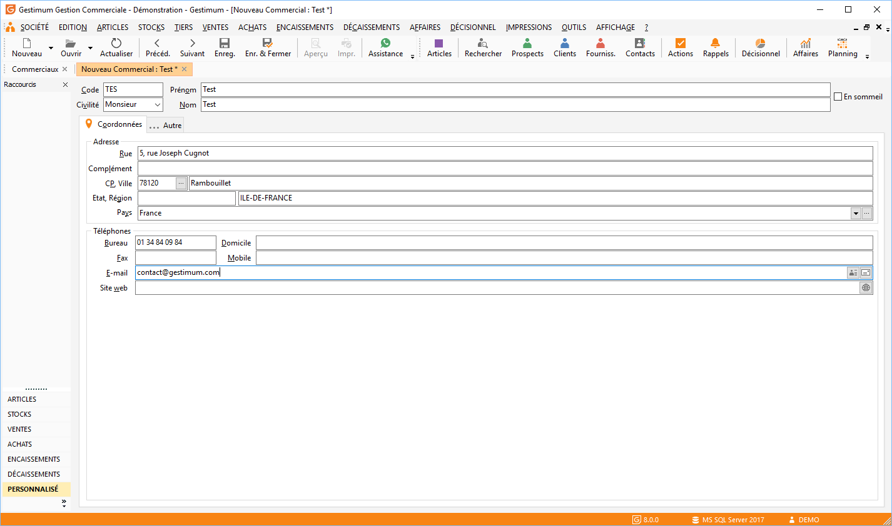
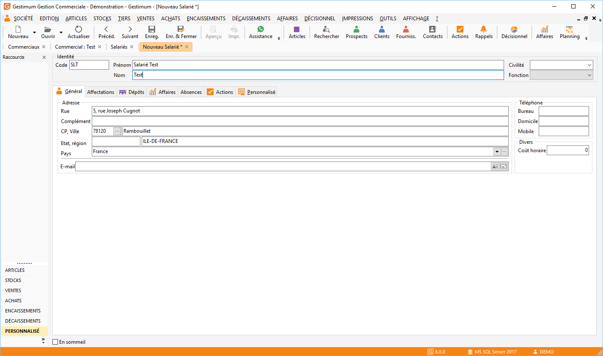
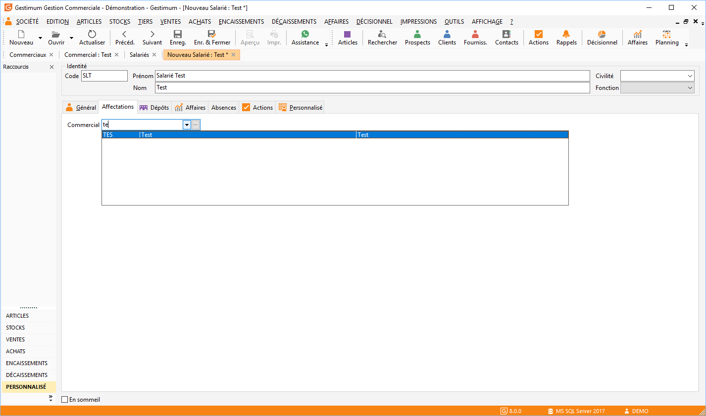
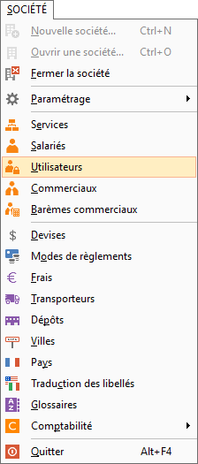
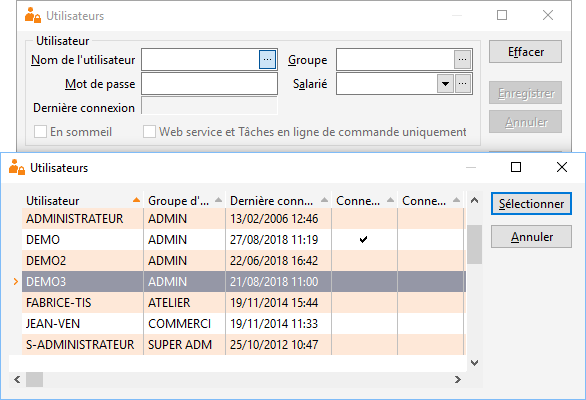
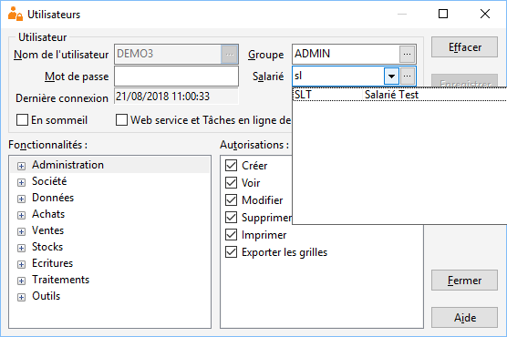
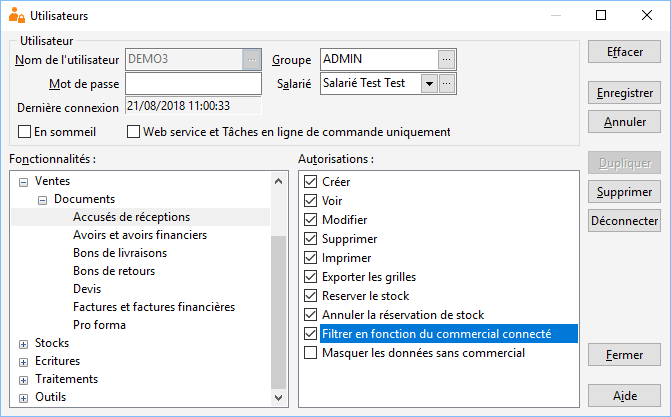

# Filtres en fonction du commercial connecté

Avec Gestimum ERP, il est possible de filtrer les documents de ventes, les affaires, les contacts, les actions et les historiques des ventes en fonction du commercial connecté.

## Création d’un commercial

Allez dans SOCIETE | Commerciaux :

 

 

Faites clic droit "Nouveau" puis créez votre commercial :

 

## Création d’un salarié et affectation du commercial

Allez dans SOCIETE | Salariés :

 

 

Faites clic droit "Nouveau" puis créez votre salarié :

 

 

* Allez dans l’onglet "affectations" et affectez votre commercial à ce salarié (attention à bien autoriser le ou les dépôts que vous voulez affecter à votre salarié dans l’onglet "dépôts")

 

## Droits utilisateurs

Allez dans SOCIETE | Utilisateurs :

 

 

Sélectionnez votre utilisateur en cliquant sur les 3 petits points (de la ligne "Nom de l’utilisateur") :

 

 

* Affectez votre salarié à cet utilisateur

 

 

Dans les droits utilisateurs cochez la case "Filtrer en fonction du commercial connecté" ainsi que "Masquer les données sans commercial" sur les différents documents de ventes ou dans les parties "AFFAIRES/Affaires", "TIERS/Contact  - Clients", "TIERS/Actions".

 

 

Pour paramétrer rapidement les droits utilisateurs de vos commerciaux, vous pouvez créer un "Groupe" nommé "Commercial".

 

Dans ce groupe vous pourrez paramétrer les droits utilisateurs pas défaut et ainsi à chaque création d’un utilisateur "Commercial" vous lui affecterez le groupe ainsi que ses autorisations.

 

Les droits permettent également de masquer les listes et fiches sans commercial attribué. La case " Masquer les données sans commercial" ne fonctionne que si la case "Filtrer les données en fonction du commercial connecté" est cochée.

 

Pour compléter le filtrage des données en fonction du commercial connecté, il faut restreindre également les droits suivants :

* Décisionnel/Statistiques de vente

* Décisionnel/Tableaux de bord

* Encaissements/Échéances

* Encaissements/Relances
* Impressions/ …

