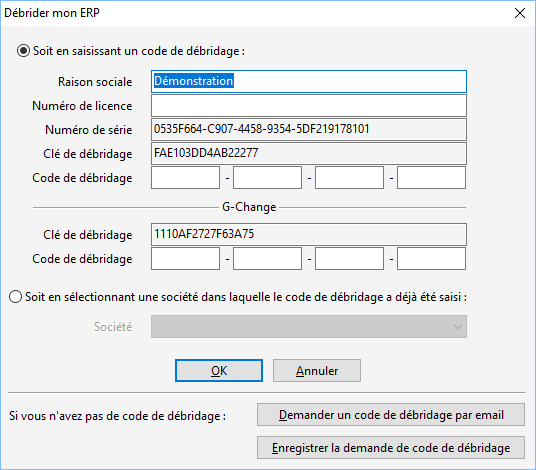
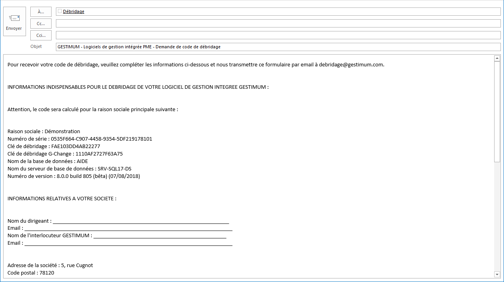
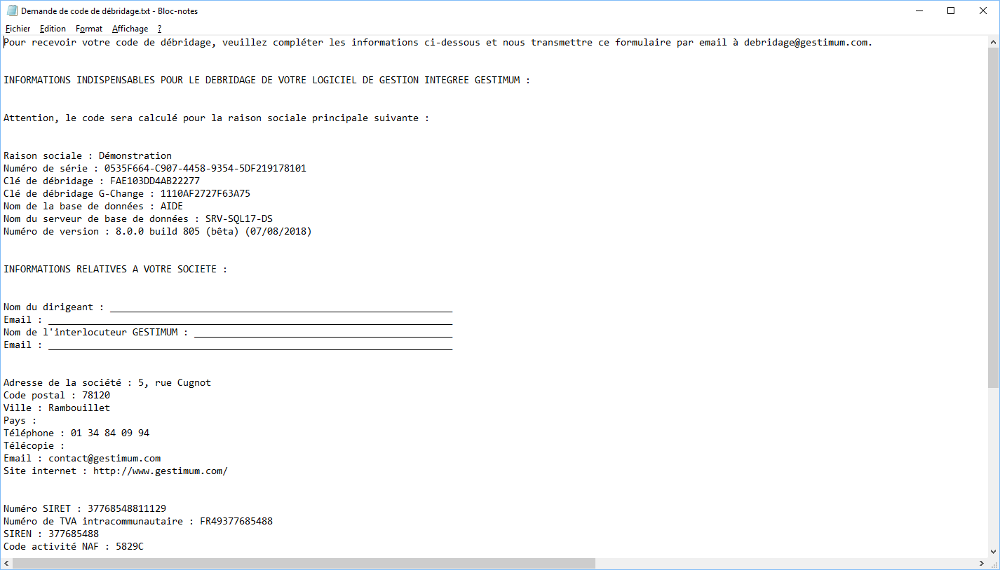

Débrider mon ERP

Le code de débridage peut être introduit au lancement du logiciel, ou à partir de la commande "Débrider mon ERP" du menu SOCIETE | Paramétrage.

# Saisie du code de débridage

## Obtention d'un code de débridage

Pour obtenir votre code de débridage, vous pouvez soit faire une demande directement par email en cliquant sur "Demander un code de débridage par email" soit enregistrer la demande dans un fichier texte en cliquant sur "Enregistrer la demande de code de débridage".

 

Attention ! Il faut que le poste sur lequel est fait la demande par email dispose d'un logiciel de messagerie.

### Exemple d'email de demande de débridage

### Exemple de fichier de demande de débridage

# Rattachement à une société débridée

Lorsque vous avez déjà une autre société débridée, vous pouvez utilisé son code de débridage en allant sélectionner cette société.

