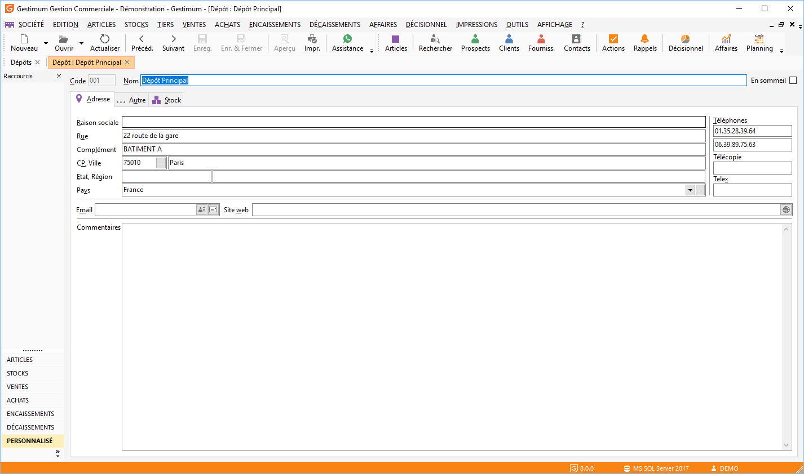

# Dépôt

 

Pour créer un dépôt vous devez obligatoirement saisir un code sur 3 caractères et un nom.

 

Ensuite, vous avez la possibilité de renseigner l’onglet [Général](OngletAdresse.md) et de consulter les onglets [Autres](OngletAutre.md) et [Stock](OngletStock.md).

