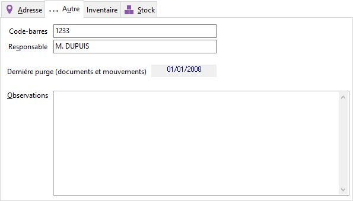

# Autre

Permet de consulter différentes informations comme le nombre d’articles dans le dépôt, le nombre d’articles déjà inventoriés, la date de l’inventaire en cours, du dernier inventaire réalisé et de la dernière purge réalisée.

 

