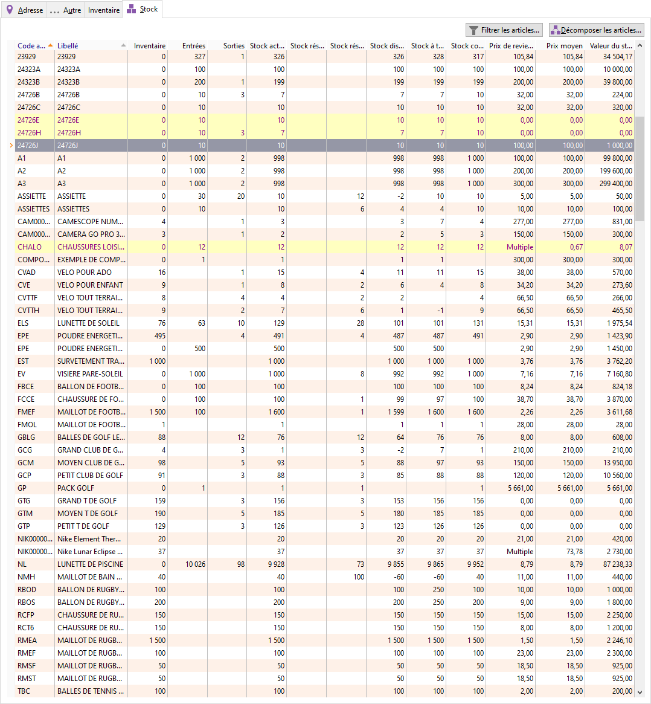

Stock

L’onglet Stock de la fiche du dépôt affiche la totalité des articles 
 stockés dans le dépôt ou bien les articles répondant à la sélection définie 
 avec le bouton "Sélection d'articles".

 

 

Chaque ligne d’article affiche les quantités en cours pour les différents 
 stocks.

 

En colonne Gamme et N° de Lot, le terme Multiple signifie que les quantités 
 indiquées englobent la totalité des gammes ou des numéros de lots du dépôt. 
 Il est possible de les décomposer.

 

Lorsque vous gérez les articles périssables, vous disposez dans les 
 propriétés de la grille de plusieurs champs spécifiques.

Le menu contextuel de cet onglet permet d’accéder aux fonctions de base 
 ainsi qu’à la consultation des mouvements de l’article courant.

