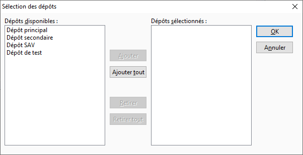

# Sélection des dépôts

Cette fenêtre permet de sélectionner un dépôt ou une fourchette de dépôts.

 

 

Elle est composée de 2 parties :

* dépôts disponibles : liste contenant les dépôts libres
* dépôts sélectionnés : liste des dépôts qui seront pris en compte lors du traitement

 

Pour passer un dépôt de l’état "disponibles" à l’état "choisis", vous devez soit :

* double-cliquer sur le dépôt
* sélectionner le dépôt et cliquer sur le bouton "Ajouter" (ou Alt + A)
* cliquer sur le bouton "Ajouter tout" (ou Alt + T) : tous les dépôts seront choisi

 

Pour passer à l’inverse (de l’état "choisis" à l’état "disponibles"), vous devez soit :

* double-cliquer sur le dépôt
* sélectionner le dépôt et cliquer sur le "bouton Retirer" (ou Alt + R)
* cliquer sur le bouton "Retirer tout" (ou Alt + U) : tous les dépôts seront de nouveau disponibles

 

Pour valider la sélection, vous devez cliquer sur le bouton "OK" (Alt + O).

 

Vous pouvez à tout moment sortir de cette fenêtre par le bouton "Annuler". Dans ce cas, aucune sélection ne sera prise en compte.

