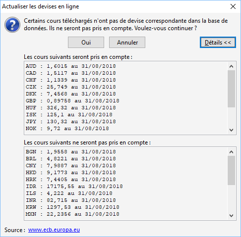

Actualisation en ligne des cours des devises

Cet outil va rechercher les cours de toutes les devises sur le site [www.ecb.europa.eu](http://www.ecb.europa.eu). La recherche des devises se fait sur le code iso de celles-ci.

 

Pour lancer l'actualisation, il faut cliquer sur le bouton "Oui".

 

Le bouton "Détails" permet de visualiser les devises qui seront mises à jour et celles qui seront ignorées.

 

Le date d'application du cour sera celui du jour du lancement de l'outils.

 

