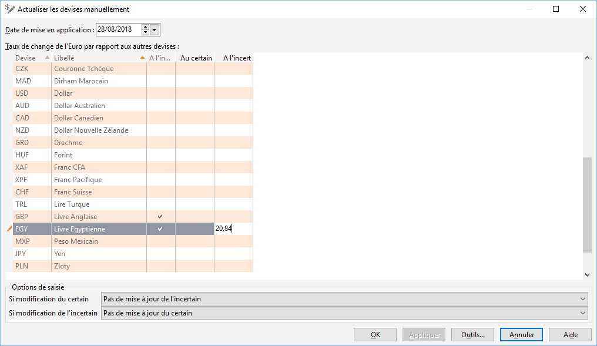

# Actualisation manuelle des cours des devises

L’actualisation des devises permet d'enregistrer un nouveau cours ainsi que sa date de mise en application.

 

Le cours de la devise est par rapport à la devise société. Dans ce dernier cas, le logiciel effectue une conversion croisée et utilise la parité Euro de la devise locale pur réaliser ses conversions.

 

Le cours de la devise peut être saisi [au certain](../2/CotationCertain.md) ou [à l'incertain](../2/CotationIncertain.md) grâce aux colonnes mise à disposition. Les deux colonnes "Au certain" ou "A l’incertain" peuvent être renseignées pour une même devise. En fonction du choix de cotation fait dans la fiche de la devise la valeur du cours utilisé sera indiquée en noire. L’autre cours figurera en gris à titre d’indication.

Si une devise est cotée à l’incertain, une coche figurera dans la colonne "A l’incertain ?".

Deux listes déroulantes permettent de paramétrer le comportement du logiciel en cas de saisie dans l’une ou l’autre des colonnes.

 

Dans le cas où une modification est faite sur un type de cours, les choix possibles sont :

* Ne pas faire de mise à jour sur l’autre type de cours,
* Mise à jour de l’autre type de cours s’il n’est pas renseigné,
* Mise à jour de l’autre type de cours systématiquement.

Après saisie du nouveau cours de chacune des devises utiles, le bouton "Appliquer" permet d’enregistrer ces cours.

 

 

Le [bouton Outils](OutilActualisationCertainIncertain.md) donne accès à un utilitaire permettant de modifier les cours antérieurs des devises.

