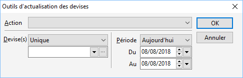

# Outils d'actualisation du certain et de l'incertain des devises

Cet utilitaire permet de modifier les cours antérieurs des devises.

 

Cette modification peut être faite sur un intervalle de date souhaité ainsi que sur une ou plusieurs devises (unique, ensemble, tous).

 

Les différents traitements qui peuvent être effectués sont les suivants :

* Calculer l’incertain à partir du certain si nul,
* Calculer l’incertain à partir du certain systématiquement,
* Calculer le certain à partir de l’incertain si nul,
* Calculer le certain à partir de l’incertain systématiquement,
* Supprimer le certain,
* Supprimer l’incertain,
* Transférer le certain dans l’incertain,
* Transférer l’incertain dans le certain.

