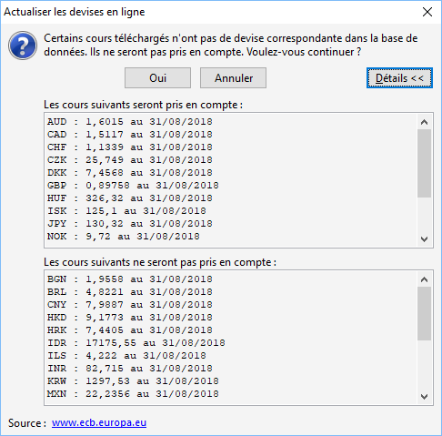

Devises de A à Z

Sur Gestimum gestion comptable et gestion commerciale il est possible de gérer différentes devises (une [devise](http://fr.wikipedia.org/wiki/Devise_(monnaie)) étant l'unité monétaire d'un pays ou d'une zone économique) en actualisant les cours manuellement ou automatiquement.

# Le paramétrage

Par défaut, Gestimum vous propose une liste pré enregistrée de devises mais il est possible d’en créer de nouvelles. (SOCIETE/Devises)

 

Il faut ensuite cliquer sur "Nouveau" pour créer une nouvelle devise. Exemple : Création de la devise Livre égyptienne.

 

Il faut commencer par renseigner le "Code", le "Libellé" puis si vous souhaitez mettre votre cours "[à l’incertain](../2/CotationIncertain.htm)" ou "[au certain](../2/CotationCertain.htm)" et enfin faites "Enregistrer".

## Cotation "a l'incertain"

Cette cotation indique le nombre d'unités monétaires locales correspondant à une unité de monnaie étrangère.

Exemple : 1USD = 1,3604 Euro

## Cotation "au certain"

Cette cotation consiste à donner le nombre d'unités monétaires étrangères équivalent à une unité de monnaie locale.

Exemple : 1 Euro = 0,9430 USD.

# L’enregistrement des cours manuellement (OUTILS/Actualiser les cours manuellement)

# 

Il faut noter une date de mise en application du taux puis dans votre devise renseignez manuellement le taux du jour qui peut être le taux moyen mensuel également. Ici vous pouvez constater que ce sera un cours à l’incertain car la devise est paramétrer avec ce type de cours. Vous faites flèches bas de votre clavier pour enregistrer votre devise et enfin "Appliquer".

 

Quand vous retournez dans votre devise vous constaterez que le cours du jour est enregistré.

 

[Pour en savoir plus sur cette outil](../6/ActualisationManuelleCoursDevises.htm).

# L’enregistrement des cours automatiquement (Outils – actualiser les cours automatiquement)

# 

Une fenêtre s’ouvre avec les devises qui seront mises à jours. (Sources : La banque centrale européenne).

 

[Pour en savoir plus sur cet outil.](../6/ActualisationLigneCoursDevises.htm)

# Paramétrage de la fiche tiers

Vous pouvez paramétrer la fiche tiers afin que votre devise soit utilisée à chaque fois que vous ferez un document d’achat ou de vente (TIERS/Clients ou fournisseurs et onglet compta de la fiche).

# Paramétrage du journal en comptabilité

Si vous utilisez Gestimum gestion comptable il faut paramétrer votre journal afin que la nouvelle devise soit utilisée. (Données/Journaux puis double clic sur le journal et enfin cochez "Saisie possible dans une autre devise).

