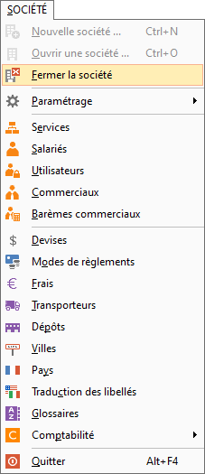
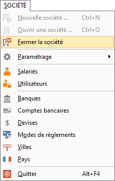

# Fermer la société

Le menu SOCIETE | Fermer permet 
 de fermer une société précédemment ouverte.

 

 

 

La fermeture de la société vous permet de lancer ensuite l’[ouverture 
 d'une autre société](../Ouvrir/1/OuvertureSociete.md).

 

Si vous souhaitez fermer ERREUR : variable (GestimumGestionCommerciale) non définie. 
 ou ERREUR : variable (GestimumComptabilite) non définie., 
 vous devez utiliser le menu SOCIETE | Quitter 
 ou le raccourci clavier Alt + F4.

