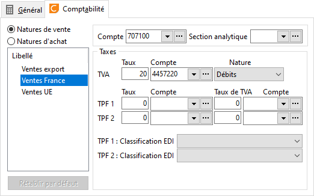

# Comptabilité

 

Le logiciel propose par défaut les informations paramétrées dans la 
 fiche de [chaque 
 nature comptable](../../NaturesComptable/1/NaturesComptables.md). Ces informations étant modifiables, il est possible 
 de paramétrer un traitement comptable particulier pour chaque frais et 
 chaque type de vente et d’achat.

## Exemple

Le compte comptable proposé pour traiter les frais est le compte général 
 indiqué dans la fiche de la nature comptable (par exemple 707100 pour 
 les ventes). Pour distinguer le montant des frais du montant brut des 
 ventes, il suffit d’indiquer un autre compte (par exemple 708500).

 

[Voir aussi](javascript:RelatedTopic0.Click())

Voir aussi (espace réservé)
 

1. [Liste des rubriques](#)

