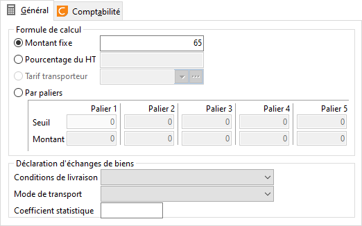

# Général

## Livraison et transporteur

Le mode de Livraison et de transport sont à sélectionner dans la liste 
 déroulante. Ces informations seront utilisées lors de la réalisation de 
 la déclaration d'échanges de biens (DEB).

### Montant du frais

Un frais peut être :

* Un montant à saisir 
 en pied de document (zone Montant fixe vierge),
* Un montant fixe,
* Un montant calculé 
 à partir des tarifs transporteur ou suivant une formule, [Cette fonction 
 n’est pas disponible actuellement]
* En fonction du montant de la facture.

### Montant Fixe

Il permet de paramétrer un montant de frais à saisir en pied de document 
 (ne saisir aucune valeur dans la zone Montant) ou de définir un montant 
 fixe de frais non modifiable en pied de document.

### Pourcentage du HT

A partir du pourcentage saisi, le frais sera calculé sur le Montant 
 Total brut du document.

### Par palier

Le seuil correspond au montant du document.

Lorsque le montant du document est inférieur ou égal au Seuil établit, 
 il sera appliqué le montant de frais correspondant, au-delà il faudra 
 faire référence au palier supérieur.

 

Exemple :

| Seuil | Montant |
| 0 | 100 |
| 50 | 80 |
| 100 | 50 |

 

Si le montant du document est 50.00, Le frais sera de 100

Si le montant du document est 50.01, Le frais sera de 80

 

[Voir aussi](javascript:RelatedTopic0.Click())

Voir aussi (espace réservé)
 

1. [Liste des rubriques](#)

