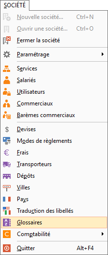
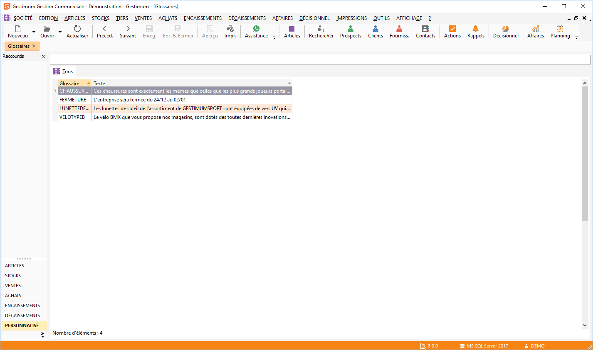
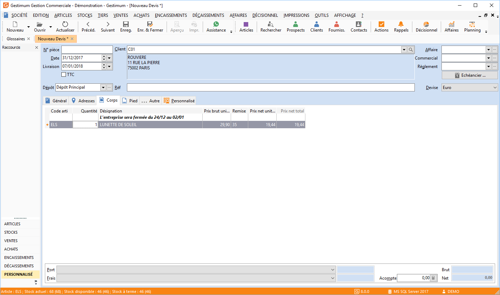
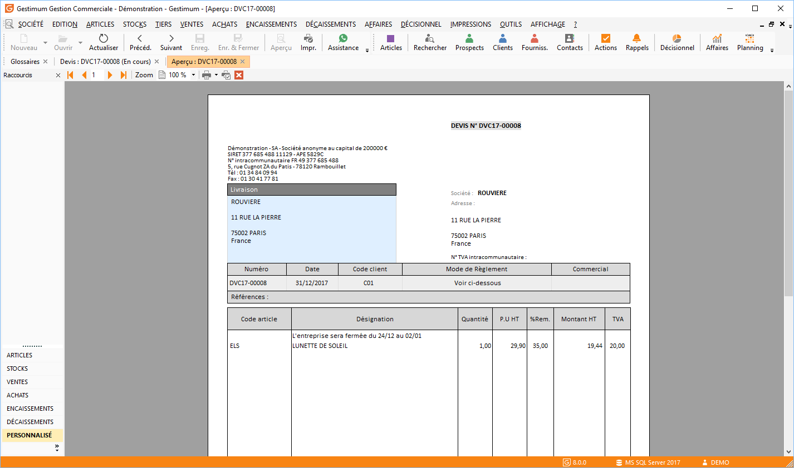

Utilisation des glossaires

Le glossaire est un outil permettant d’afficher automatiquement un texte informatif dans un document de vente ou d’achat.

# Création d’un glossaire

* SOCIETE/Glossaire,

* Faire clic droit "Nouveau" ou bien en haut à gauche du logiciel "Nouveau",

* Veuillez rentrer un "code" qui vous permettra de retrouver votre glossaire ainsi qu’un "libellé" explicatif puis faites "Enregistrer & fermer",

 

Dans la liste des glossaires vous retrouvez l’ensemble des glossaires disponibles.

# Utilisation du glossaire

Une fois votre glossaire créé, veuillez préparer un nouveau document de vente ou d’achat (ventes – nouveau document de vente) puis cliquez 2 fois dans la zone "Désignation" de votre document et enfin cliquez sur les 3 petits points.

 

Une fois cliqué sur les 3 petits points de la zone "Désignation", une fenêtre va s’ouvrir avec la liste complète de vos glossaires précédemment créés.

 

Faites un double clic sur le glossaire que vous souhaitez utiliser et celui-ci apparaîtra sur votre document.

 

 

Lors de l’impression (clic droit "Imprimer" sur votre document) de votre document, le message ainsi inséré apparaîtra.

 

