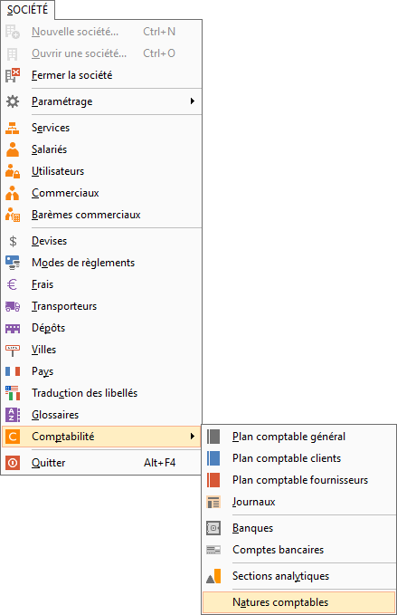
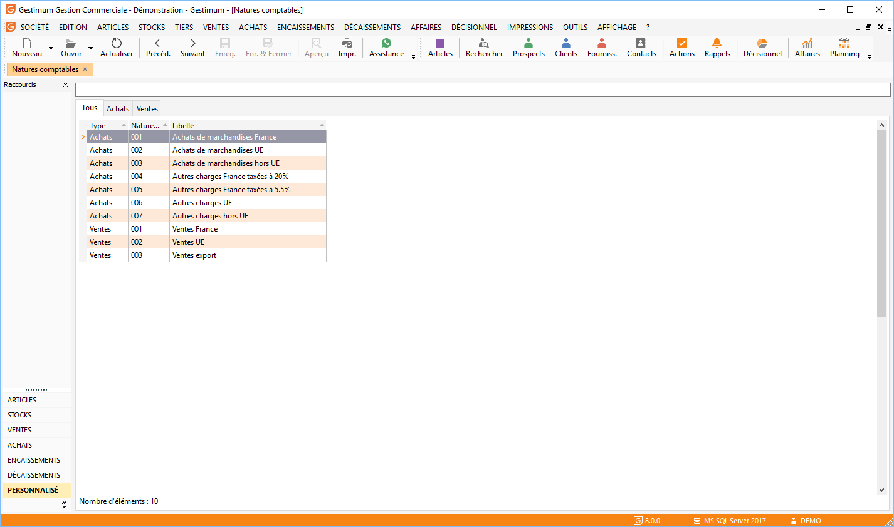
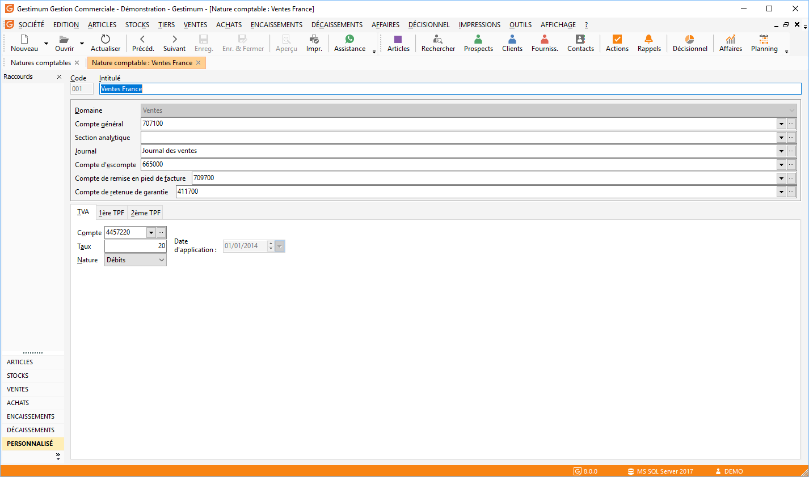

# Natures comptables

Les natures comptables sont à définir avant la mise en place des fichiers de données (clients, fournisseurs, articles, frais de port, …).

 

Les natures comptables sont utilisées lors de :

* La transformation des factures de ventes et d’achats en pièces comptables de ventes et d’achats,
* A la saisie des documents de vente et d’achat.

 

Le logiciel propose automatiquement 6 natures comptables :

* Achats de marchandises France,
* Achats de marchandises UE,
* Achats de marchandises hors UE,
* Ventes France,
* Ventes UE,
* Ventes Export.

 

L'accès se fait via le menu SOCIETE | Comptabilité | Natures comptables.

 

 

Sur la fenêtre suivante apparaîtra la "liste des natures comptables" créée sur Gestimum ERP.

 

 

Chaque nature comptable décrit les numéros de compte comptable, les taux de taxes, les natures de TVA et de TPF à utiliser pour chaque article en fonction du client ou du fournisseur, pour impacter le pied d’un document et lors du transfert comptable.

 

### Caractéristique de la fiche "Nature comptable"

#### Domaine

La sélection d’un domaine est obligatoire. Une nature peut être soit de type Vente, soit de type Achat.

#### Compte général

La saisie de ce champ est obligatoire pour le transfert comptable de vos pièces. Le compte général doit correspondre au compte de ventes ou d’achats le plus courant.

#### Section analytique

Cette section analytique est prise en compte lorsque vous avez paramétré l’option " Analytique en gestion " dans les préférences de la gestion (onglet ventes et/ou achats).

La saisie de ce champ permet de réaliser le transfert comptable à 100% de cette section vers les Écritures analytiques reliées au compte général ci-dessus.

### Journal

Pour un transfert comptable vers GESTIMUM Comptabilité ou vers un fichier texte, le choix du journal est obligatoire. Le fichier des journaux est commun aux logiciels GESTIMUM Gestion Commerciale et GESTIMUM Comptabilité.

#### Escompte / Remise en pied de facture / Retenue de garantie

Sélection obligatoire des comptes pour distinguer les montants d’escompte, de remise en pied de facture et la retenue de garantie sur les Écritures comptables suite au transfert comptable.

#### TVA

Le numéro de compte de TVA doit correspondre au compte de TVA le plus courant pour ce type de vente ou d’achat. Il en va de même pour le taux de TVA et la nature de TVA.

 

Il faut que le compte de TVA sélectionné est le même paramétrage que celui de la nature sur les points suivants :

* le taux,
* la nature.

Lors du transfert comptable, s'il y a une différence entre les 2, Gestimum prendra la compte comptable ayant le paramétrage le plus proche de la nature comptable.

 

En cas de changement du taux de TVA, il suffit d’indiquer la date de mise en application et de saisir le nouveau taux pour que celui-ci soit pris en compte automatiquement.

 

Attention : le compte de TVA appelé doit être correctement paramétré dans le plan comptable général 1ère et 2ème TPF.

Il est possible de paramétrer deux TPF en indiquant pour chacune d’entre elles si elle est soumise ou non à la TVA. Plusieurs formules de calcul sont disponibles.

#### TPF

Les taxes complémentaires  sont des taxes supplémentaires à la TVA applicable sur la fabrication ou la commercialisation de certains articles dans les  domaines comme : le tabac, l'alcool, textile, ameublement, pêche, industrie du cuir, horlogerie, informatique, électronique, etc.

 

Exemples : TPF / Taxe DEE (recyclage des déchets électroniques) / Taxe sur les alcools.

 

Il est possible de paramétrer deux taux complémentaires (nommés TPF) en indiquant pour chacun d’entre eux s'il est ou non taxé à la TVA.

 

Cette taxe est calculée sur la base HT et il est possible de lui appliquer également un taux de TVA calculé sur le montant TPF.

 

Ces deux onglets disposent des champs suivants :

* Compte comptable taxe complémentaire associé à la taxe complémentaire lors du transfert comptable
* Taux : Taxe complémentaire appliqué pour cette taxe
* Calcul : Formule appliquée

1. Sur la valeur (V)
2. Sur la valeur Nette (N)
3. Sur la quantité (Q)
4. Sur Quantité \* Champ 1 (TPF quantité 1 de la fiche article)
5. Sur Quantité \* Champ 2 (TPF quantité 2 de la fiche article)
6. Conditionnement de vente \* Quantité \* Champ 1
7. Conditionnement de vente \* Quantité \* Champ 2
8. Quantité \* Champ 1 \* Champ 2
9. Conditionnement de vente \* Quantité \* Champ 1 \* Champ 2

* Compte de TVA sur le montant TPF
* Taux de TVA sur le montant TPF

 

Remarque

Cette taxe peut être paramétrée à plusieurs niveaux dans le logiciel :

* Fichier/ Natures comptables
* Données/ Articles/ Familles et Sous-familles d’articles
* Fiche article
* Dans les lignes de documents, la sélection d'un autre type de calcul, du taux et
* de la nature sont possibles.

 

Pour voir le paramétrage général de la fiche cliquez ici.

