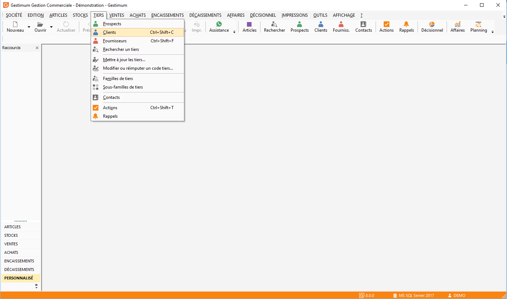
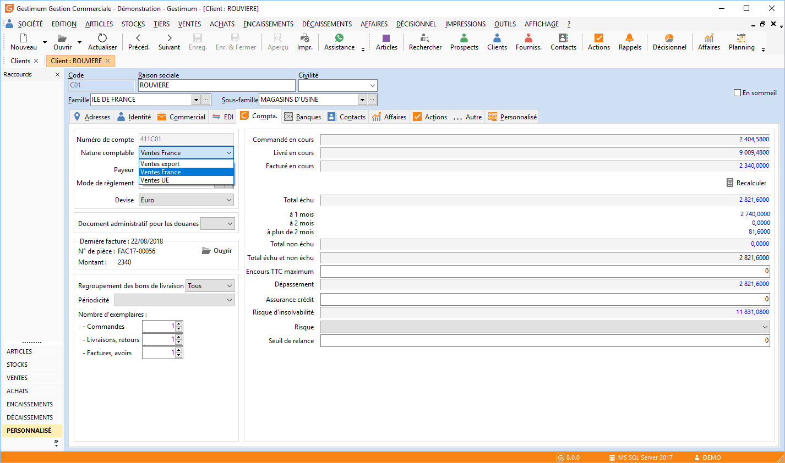
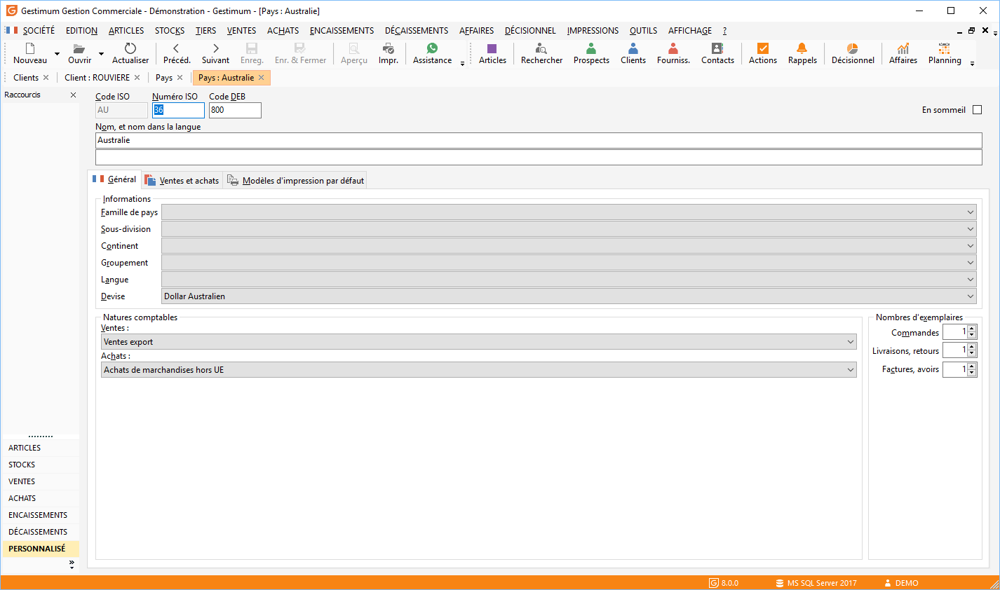
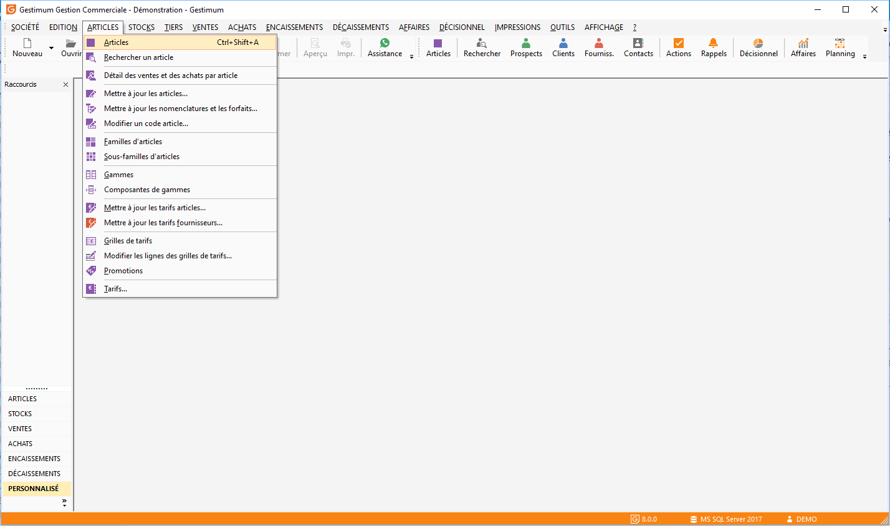
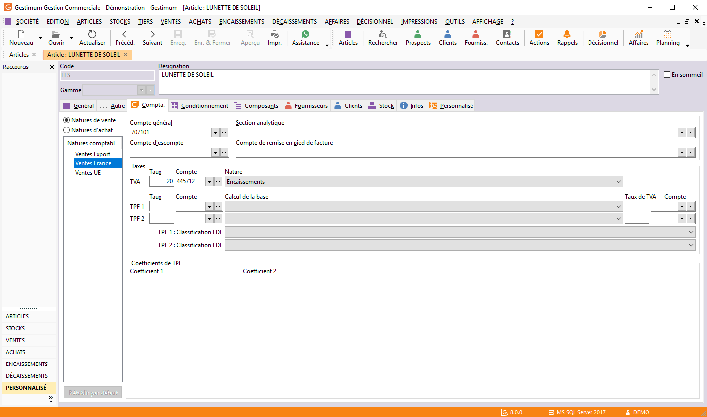
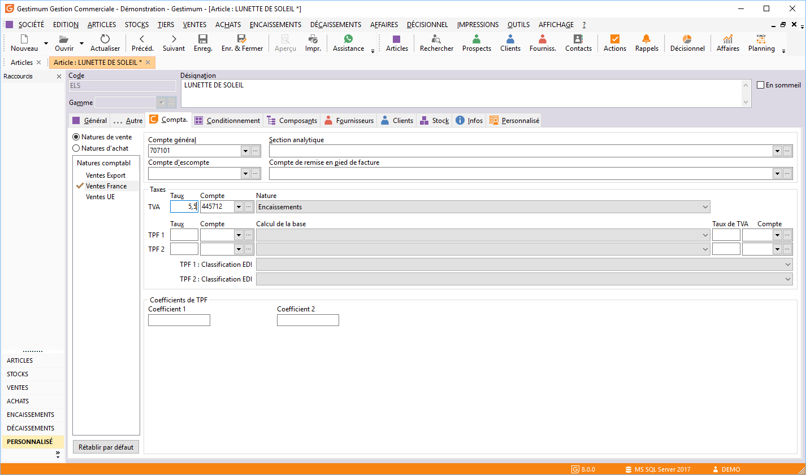
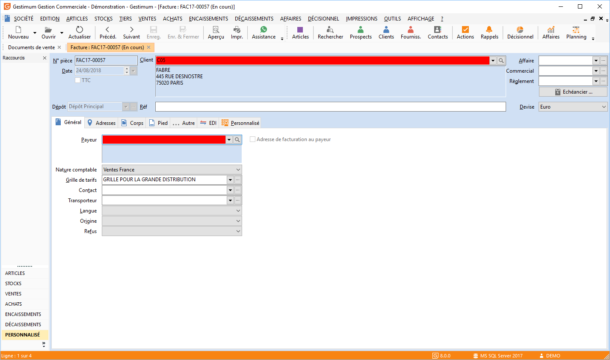
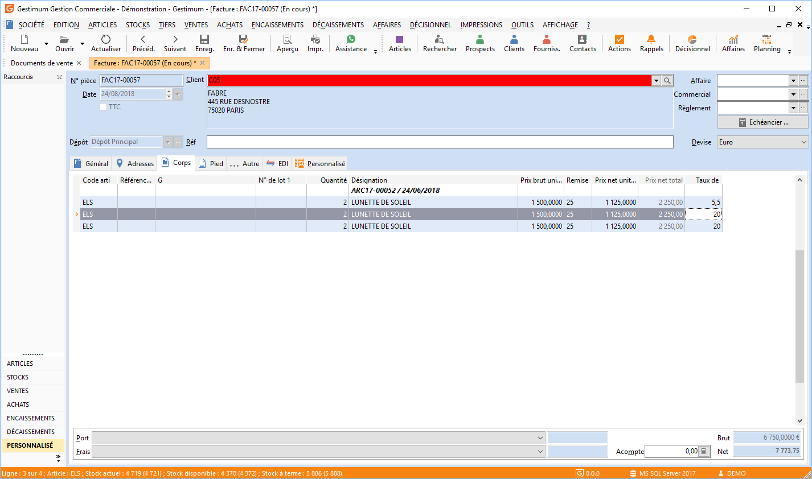

Utilisation des natures comptables

Après avoir fait le [paramétrage de base des natures comptables](../1/NaturesComptables.htm), il faut vérifier le paramétrage dans:

* les tiers,
* les pays.

 

Vous avez aussi la possibilité de faire une paramétrage spécifique pour sur une famille d'article, une sous-famille ou sur un article.

# Paramétrage de la fiche client/fournisseur

* Allez "TIERS/Clients-fournisseurs",

 

* Allez dans l’onglet "Compta" de la fiche client ou fournisseur,

 

* Sur chaque fiche client et fournisseur, il faut attribuer la nature comptable qui correspondra au régime applicable au tiers. Une nature comptable unique est associée à un tiers (onglet compta de la fiche tiers).

# Paramétrage dans le fiche "pays"

Il est important de vérifier que les pays soit bien associé à la bonne nature comptable. Lorsque vous sélectionnez un pays dans une fiche tiers, celle-ci hérite de la nature du pays.

# Paramétrage de la fiche "article"

* Allez dans "ARTICLES/Articles",

 

* Allez dans la l’onglet "Compta" de la fiche article. Ici vous visualiserez les informations des natures comptables,

 

* Pour chaque fiche famille article, sous-famille article, article et fiche frais, les informations des natures comptables sont proposées par défaut et peuvent être modifiées (le symbole "coché" signale alors la modification). Par exemple si la nature comptable vente France de l’article n’a pas une TVA de 20% mais 5,5% vous pouvez modifier le taux ici (la "coche orange" apparaîtra à coté de votre nature comptable.

# Le document d’achat ou de vente

Lors de la facturation, le logiciel recherche la nature comptable (Achat ou Vente) du tiers ou de l’article.

 

Exemple : Pour un client dont la nature comptable est Vente France taux 20 Et achète des articles à un taux de TVA de 5. 5%. Dans l’onglet "Entête" du document de vente la nature correspond bien au paramétrage de ma fiche client.

 

Dans l’onglet "Lignes" de mon document de vente, le logiciel reprend bien mon taux de TVA 5,5% paramétré dans ma fiche article.

