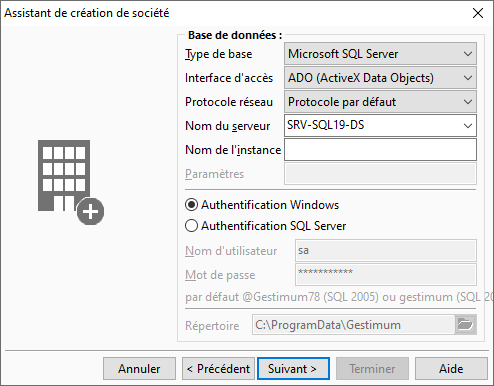

# Base de données

Cette fenêtre permet de paramétrer la structure de la base et l’emplacement 
 de celle-ci.

 

## Paramétrage de la base de données

Le logiciel permet de créer une base de données de type SQL uniquement.

 

Le mode SQL (Microsoft SQL Server) utilise en général un serveur de 
 données dédié.

 

Pour ce type de base, vous devez préciser le moteur d’accès et les protocoles 
 réseau : ADO (ActiveX Data objects).

 

Vous avez le choix du Protocole réseau :

* Protocole par défaut
* Canaux nommés
* TCP/IP
* Multiprotocole

 

L'instance et les paramètres sont renseignés en fonction du protocole 
 choisi.

## Emplacement de la base de données

Pour créer une société SQL Server, vous devez obligatoirement renseigner 
 le nom du serveur, le nom de connexion et éventuellement un mot de passe.

### Nom du serveur

En MS-SQL SERVER, vous devez indiquer le nom du serveur de données sur 
 lequel la base SQL est/ou sera créée.

### Type de connexion

Vous avez 2 possibilités d’authentification :

* L’authentification 
 Windows : SQL Server utilise 
 les informations utilisateurs de Windows pour valider la connexion. 
 Il faut donc auparavant avoir défini les droits utilisateurs Windows 
 pour chaque utilisateur ou pour chaque groupe.

* L’authentification 
 SQL Server : La connexion 
 doit avoir été ajoutée sous SQL Server. Gestimum propose un mot de 
 passe par défaut pour les versions SQL 2000 = Gestimum (en minuscules) 
 et pour SQL 2005 = @gestimum78 (les majuscules et minuscules doivent 
 être respectées).

