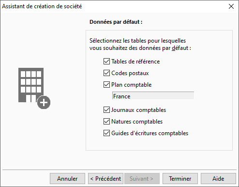

Données par défaut

Le logiciel propose d'initialiser différents fichiers de base optionnels 
 à la création.

 

 

Les fichiers codes postaux et plan comptable dépendent du pays de la 
 société. Ces fichiers sont paramétrables dans le sous-dossier "Bases" 
 situé par défaut dans le dossier "Gestimum".

# Tables de référence

Le logiciel propose de créer les tables de référence : unités de conditionnement, 
 fonctions, catégories de règlement, statuts juridiques, natures d'inscription, 
 libellés automatiques, constantes numériques.

 

Les tables de référence devront être complétées par la commande SOCIETE | Paramétrage | Tables de référence 
 après création de la société.

# Codes postaux

Un fichier des codes postaux spécifique au pays de la société (département, 
 état, région, ..) est proposé. 

 

Ce fichier peut-être créé pour un pays précis dans le répertoire "Bases" 
 qui se situe sous la racine Gestimum.

 

Le nom de ce fichier doit-être Villes."code 
 du pays".

 

Exemples : Villes.be, Villes.lu.

# Plan comptable

Le plan comptable proposé par défaut est celui du pays de la société.

 

Lorsque le pays de la société est France, les comptes de regroupement 
 sont créés automatiquement dans le plan comptable et les informations 
 de TVA sont mises à jour dans les comptes correspondants.

# Journaux comptables et natures comptables

Le logiciel propose de créer automatiquement les journaux comptables 
 du pays de la société.

 

En France, le logiciel crée les journaux suivants : Achats, Ventes, 
 Opérations Diverses, A Nouveaux.

 

Les natures comptables achats et ventes sont créées automatiquement 
 par défaut.

 

Après création de la base de données, le logiciel affiche la fenêtre 
 des paramètres société.

