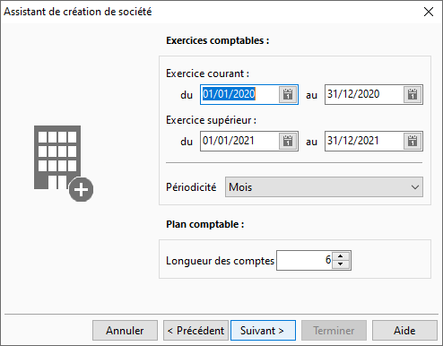

Exercices comptables
====================

La gestion commerciale est indissociable de la gestion comptable, c'est 
 pourquoi il est nécessaire de définir ici le type de comptabilité à tenir.

 

## Exercices comptables

Le logiciel propose par défaut un exercice comptable allant du premier 
 au dernier jour de l'année courante.

 

Il propose également un exercice supérieur permettant d'enregistrer 
 des écritures même si l'exercice comptable courant n'est pas encore clôturé.

## Périodicité

Dans la comptabilité française, les périodes de référence sont calquées 
 sur les mois de l'année. Il faut choisir "Mois" comme périodicité.

 

Pour d'autres pays, ces périodes peuvent être au nombre de 13. Il faut 
 alors choisir "13 mois" comme périodicité.

L'assistant de création propose alors une étape supplémentaire afin 
 d’adapter le nombre de périodes de la comptabilité à traiter.

## Longueurs des comptes

La longueur maximale d'un compte est de 15 caractères.

 

Le cadrage de compte permet de définir une longueur 
 minimale. De ce fait, lorsque la longueur d'un compte est inférieure à 
 la longueur demandée, le logiciel ajoute autant de zéros que nécessaire.

 

Si vous indiquez zéro (0), aucun cadrage ne 
 sera effectué.

