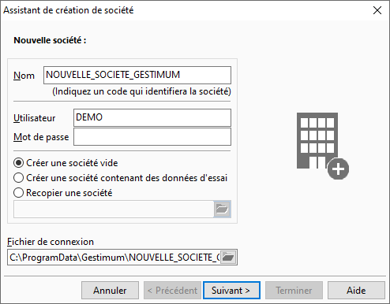

Nouvelle société
================

Le nom de la société permet de répertorier l'ensemble des fichiers ou 
 de pointer la base de données.

 

## Nom de la société

En mode SQL (Microsoft SQL Server), le nom de la société correspond 
 à la base qui sera créée (si l’utilisateur a les droits d’administration 
 sur le serveur de données) ou à la base déjà créée sur le serveur de données 
 (création au préalable de la base sur le serveur de données par l’administrateur).

## Utilisateur

Le nom de l'utilisateur du poste est proposé par défaut. La saisie de 
 l’utilisateur est obligatoire, elle détermine la création de l’utilisateur 
 dans la base.

## Mot de passe

Il n’est pas obligatoire. C’est le mot de passe de l’utilisateur.

## Créer une société vide

Création d’une société avec ou non les données de base.

## Créer une société de démonstration

Création d’une société de démonstration avec des données (Tiers, Articles, 
 Documents, Écritures…). Vous devez paramétrer uniquement les informations 
 de l’écran [choix de la base](BaseDonnees.htm).

## Recopier une société

Ce champ vous permet de référencer le point Gestimum d’une société existante 
 afin de copier celle-ci dans votre nouvelle société.

Lorsque vous renseignez ce champ, l’assistant détecte que vous être 
 en [copie de société](../2/DupliquerBaseDonnees.htm) 
 et vous propose les écrans de copie.

## Fichier de connexion de la société

C’est le chemin de l’emplacement du fichier Gestimum. Ce chemin est 
 modifiable par le bouton .

