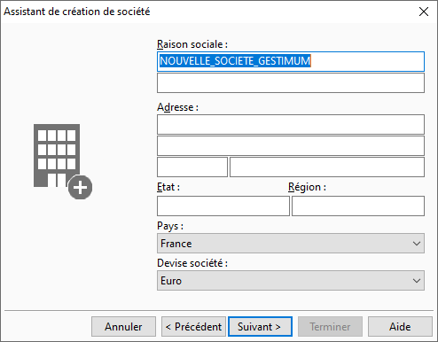

Raison sociale et adresse

 

La saisie de la raison sociale est obligatoire. Elle est renseignée 
 par défaut avec le nom de la société saisie dans l’écran précédemment.

 

Le choix du pays où la société est installée est très important (par 
 défaut France), puisqu'il détermine la devise société dans laquelle la 
 société travaille.

 

Le choix de la devise société Euro permet de sélectionner une devise 
 locale afin d’avoir le comparatif avec la devise de base du pays.

 

Du choix du pays découle également la [création 
 des fichiers](DonneesDefaut.htm) par défaut comme les codes postaux spécifiques au pays, 
 le plan comptable (suisse, anglais, marocain, …) et les journaux comptables.

