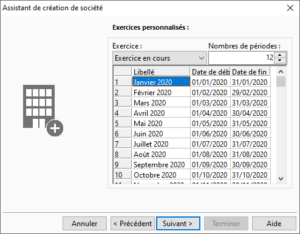

Tableau des périodes d'exercices comptables

Le tableau des périodes propose par défaut 13 périodes de 28 jours pour 
 l'exercice en cours et l'exercice supérieur, ce qui permet de traiter 
 la comptabilité sur d'autres périodes que le mois.

 

Il est toutefois possible de modifier le nombre de périodes et de définir 
 manuellement le premier et dernier jour de chacune des périodes.

 

