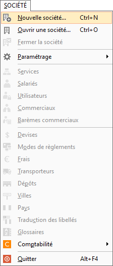
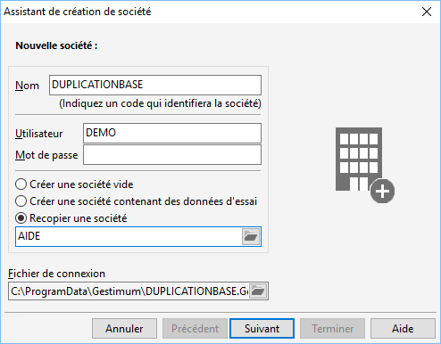
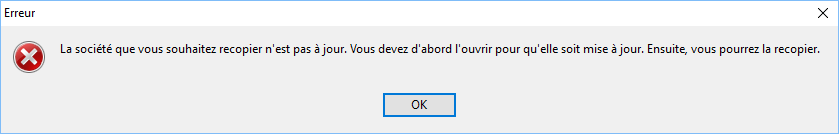
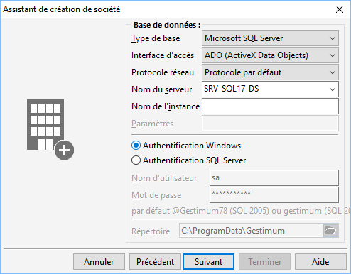
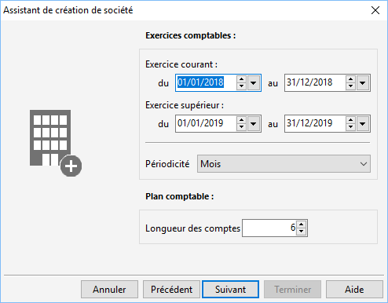
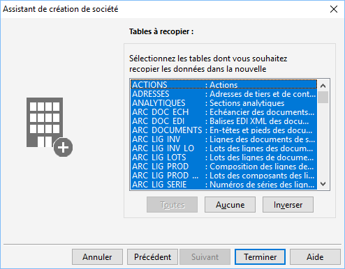
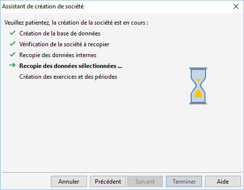

Dupliquer une société

Sur Gestimum ERP, il est possible de "dupliquer" une base 
 de données afin que vous puissiez, par exemple, faire des tests sur une 
 base de données qui comprendra vos propres données.

 

Pour les manipulations suivantes, installez-vous sur le poste serveur.

 

Il faut aller dans SOCIETE 
 | Nouvelle société. Attention il ne faut pas que vous soyez connecté 
 à une société pendant cette manipulation.

 

 

Ensuite vous mettez un "Nom", un "Utilisateur", 
 cochez "Recopier une société" et enfin sélectionnez votre base 
 de données principale pour la dupliquer. (Puis faites "suivant").

 

 

Attention il faut que la base de données que 
 vous souhaitez recopier soit de la même version que la nouvelle base. 
 Si ce n’est pas le cas vous aurez le message d’erreur suivant.

 

 
 
  
Sur la fenêtre suivante il vous faut renseigner 
 votre "Nom de serveur" puis cochez "Authentification Windows". 
 (Si vous connaissez votre "Nom d’utilisateur" et votre mot de 
 passe vous pouvez sélectionnez "Authentification SQL Server").

 

 
  
Ensuite il faut sélectionner les dates d’exercices 
 courant et supérieur! Attention c’est une étape importante vous ne pourrez 
 plus ensuite revenir dessus une fois la base créée.

 

 
  
L’étape suivante va servir à recopier ce que 
 vous souhaitez de la base principale. Si vous souhaitez recopier l’ensemble 
 des données cliquez sur "Toutes".

Si vous ne voulez qu’une partie des données, 
 par exemple que les articles, il faudra prendre toutes les tables commençant 
 par ART\_\*\*\*\*.  Pour certains cas spécifiques, contactez l’assistance 
 Gestimum au 01.34.84.09.99 ou votre partenaire Gestimum.

 

 
  
Une fois les paramètres effectués, cliquez sur 
 "Terminer". Le logiciel va ensuite créer la base de données.

 

