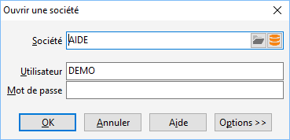

# Ouverture de société

Pour ouvrir une société, il faut tout d'abord [fermer 
 la société](../../Fermer/FermerSociete.htm) en cours (menu SOCIETE) puis lancer la commande "Ouvrir 
 une société" qui est alors active.

 

## Société

Pour sélectionner la société à ouvrir, vous devez soit  :

* Cliquer sur l'icône 
 , puis sélectionner dans la liste des raccourcis société proposés 
 \*.Gestimum, le raccourci correspondant à la société à ouvrir, et cliquer 
 sur le bouton Ouvrir ou double-cliquer directement sur le raccourci.
* Sélectionner l’icône 
 permet d’ouvrir l'[assistant 
 de connexion](../2/AssistantConnexion.htm) afin de créer le raccourci pour ouvrir la société.

## Options

Ce bouton permet de :

* déconnecter un 
 utilisateur (lorsque celui-ci est en erreur sur son poste),
* ouvrir la société 
 en mode "Exclusif" (afin d’interdire l’ouverture de la société 
 par un autre utilisateur, pour lancer en toute sécurité un traitement 
 particulier, par exemple, le transfert comptable),
* activer ou non 
 la vérification de la base à l’ouverture.

## Utilisateur

Le nom d'un utilisateur doit obligatoirement être saisi. Le logiciel 
 propose automatiquement le dernier utilisateur connecté.

## Mot de passe

Sans le mot de passe associé à l'utilisateur, la société ne pourra pas 
 être ouverte. Les mots de passe se définissent dans "la gestion des 
 utilisateurs" du menu SOCIETE et peuvent être modifiés par le menu 
 SOCIETE/Paramétrage + "Changer de mot de passe".

[Voir aussi](javascript:RelatedTopic0.Click())

