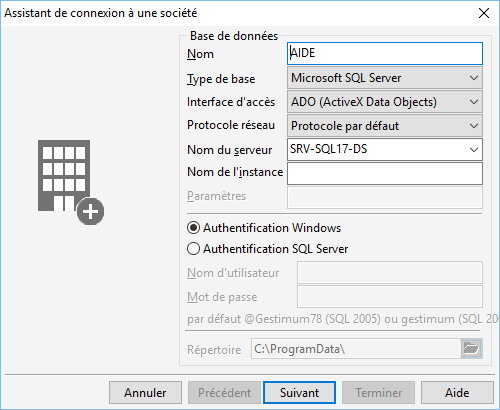

# Base de données

La première page de l’assistant vous permet de paramétrer la connexion 
 à la base de données.

 

## Base de données

 

## Nom

Afin d’effectuer une connexion correcte à la société, vous devez vous 
 assurer du nom de la société pour laquelle vous voulez vous connecter 
 et de l’existence de l’utilisateur sur celle-ci.

 

En mode SQL (Microsoft SQL Server), le nom de la société correspond 
 à la base déjà créée sur le serveur de données (création au préalable 
 de la base sur le serveur de données par l’administrateur).

## Type

Le logiciel permet de créer une base de données Microsoft SQL Server 
 uniquement.

 

En général un serveur de données dédié est utilisé. Vous pouvez toutefois 
 utiliser la version Express installée en local.

 

Pour ce type de base de données, vous devez préciser le moteur d’accès 
 et le protocole réseau.

## Protocole réseau

Il permet de définir le protocole à utiliser pour se connecter au serveur 
 SQL. En choisissant "Protocole par défaut", Gestimum utilisera 
 tous les protocoles activés dans l'utilitaire "cliconfg.exe".

## Emplacement de la base

Pour créer une société, vous devez obligatoirement renseigner le nom 
 du serveur, le nom de connexion et éventuellement un mot de passe.

## Nom du serveur

En réseau, vous devez indiquer le nom du serveur de données sur lequel 
 la base SQL est / ou sera créée.

 

En local, vous pouvez mettre un point [.] dans le nom du serveur.

### Authentification

Vous avez 2 possibilités d’authentification :

#### Authentification Windows

SQL Server utilise les informations utilisateurs de Windows pour valider 
 la connexion. Il faut donc auparavant avoir défini les droits utilisateurs 
 Windows pour chaque utilisateur ou pour chaque groupe.

#### Authentification SQL Server

La connexion doit avoir été ajoutée sous SQL Server.

 

Gestimum propose un mot de passe par défaut :

- pour SQL Server 2000 : Gestimum (majuscules et minuscules doivent 
 être respectées)

- pour SQL Server 2005 et + : @gestimum78 (majuscules et minuscules 
 doivent être respectées)

