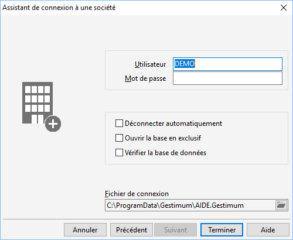

Utilisateur et options

Cette page vous permet de paramétrer l’utilisateur qui se connecte à 
 la base et les options de connexion.

 

# Utilisateur

Le nom de l'utilisateur du poste est proposé par défaut. La saisie de 
 l’utilisateur est obligatoire, les droits de celui-ci sont pris en compte 
 à partir de ce moment.

# Mot de passe

Si un mot de passe existe pour cet utilisateur, vous devez le saisir. 
 Ce mot de passe peut être changé à tout moment.

# Options de connexion

Cette partie permet de :

* déconnecter un 
 utilisateur (lorsque celui-ci est en erreur sur son poste)
* ouvrir la société 
 en mode "Exclusif" (afin d’interdire l’ouverture de la société 
 par un autre utilisateur, pour lancer en toute sécurité un traitement 
 particulier, par exemple, le transfert comptable)
* activer ou non 
 la vérification de la base à l’ouverture

# Enregistrement du fichier de paramétrage

C’est le chemin de l’emplacement du fichier "\*.Gestimum". 
 Ce chemin est modifiable par le bouton 

 .

