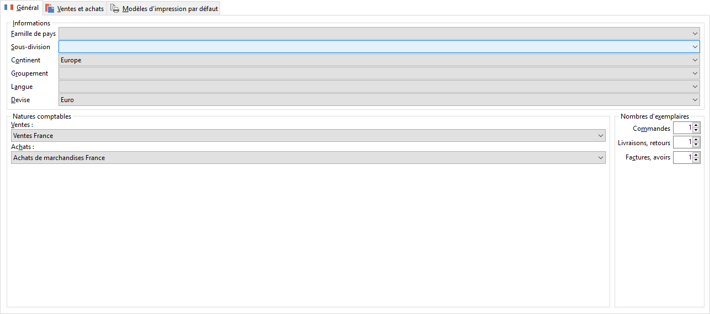

# Général

 

La saisie de la famille, de la sous-division, du continent et du groupement 
 auquel appartient le pays (à définir dans les [tables](../../TablesReferences/2/TablesReferenceGenerales.md)) 
 permettra d’obtenir différentes statistiques.

 

La langue (à définir dans les [tables](../../TablesReferences/2/TablesReferenceGenerales.md)), 
 la [devise](../../Devises/1/ListeDevises.md) et la [nature 
 comptable](../../NaturesComptable/1/NaturesComptables.md) associées au pays sont des informations proposées par défaut 
 en création de tiers (à la saisie du pays), tout comme le nombre d’exemplaire 
 à imprimer.

