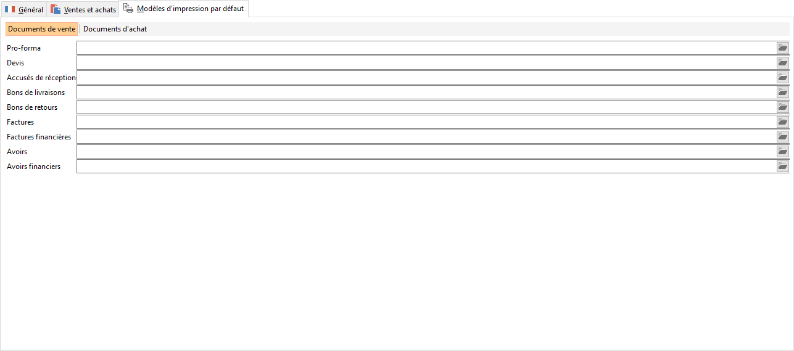

Modèles d'impression par défaut

Un modèle d’impression particulier (à créer avec ReportMaker ou ReportBuilder) peut être associé à chaque type de document d’[achats](../../PreferencesGestion/2-4/Modeles/OngletModelesAchats.htm) et de [ventes](../../PreferencesGestion/2-4/Modeles/OngletModelesVentes.htm) pour chaque pays.

 

 

Le nombre de caractères maximum est de 50 sans l’extension.

 

A l’impression d’un document, le logiciel recherche le pays de l’adresse de facturation du document (onglet Entête), et utilise le modèle associé au type du document défini ici.

 

Si aucun modèle n’est défini dans la fiche pays, l’impression des documents s’effectuera suivant le modèle défini dans les préférences de la gestion. Si ces préférences ne sont pas renseignées, l’impression ‘‘suivant les paramètres’’ s’effectuera d’après le modèle par défaut "Générique".

 //<![CDATA[
 if (typeof(FilePopupInit) != 'function') FilePopupInit = new Function();
 FilePopupInit('a1');
 FilePopupInit('a2');
 //]]>
 
