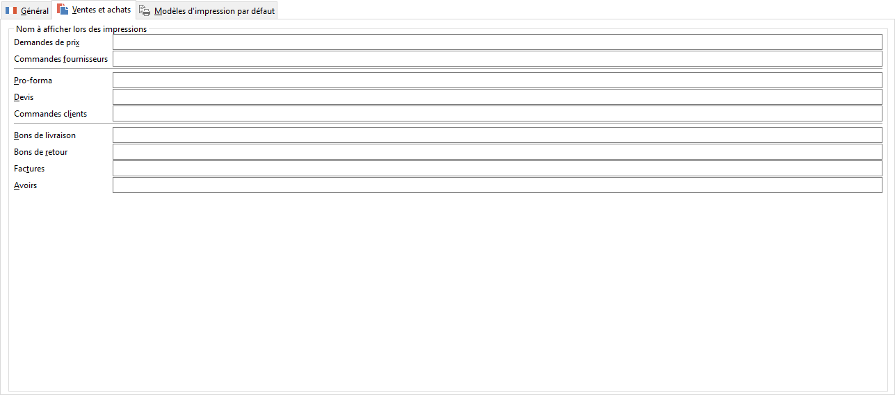

Ventes et achats

Chaque pays ayant des appellations différentes pour ses documents, il est possible de préciser un libellé particulier (dans la langue du pays par exemple) qui apparaîtra en haut des documents imprimés.

 

Exemple : une facture en anglais se dit INVOICE, …

 

 

Lors d’un transfert de document, la ligne de commentaire générée pour indiquer le document d’origine tient compte de ce libellé particulier.

 

A l’impression d’un document, le logiciel recherche le pays de l’adresse de facturation du document (onglet Entête), et utilise le libellé associé au type du document défini ici.

