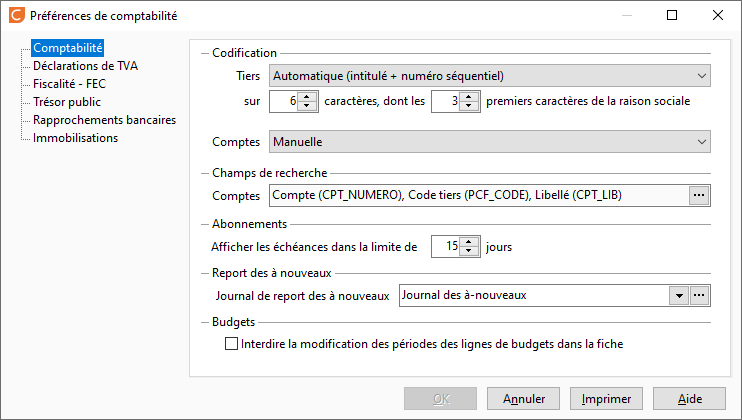

# Comptabilité

Cet onglet vous permet de saisir le paramétrage spécifique à votre comptabilité :

 

## Codification des tiers

Il est possible de gérer une codification manuelle ou automatique.

 

En codification automatique, il faut indiquer la longueur du code tiers (entre 6 et 15) et la longueur du préfixe (nombre de caractères pris sur la raison sociale). Par exemple une codification : 8 et 2 donnera un code tiers sur 8 caractères commençant par les deux premiers caractères de la raison sociale.

## Compte comptable

Les comptes comptables de tiers peuvent être générés suivant plusieurs principes :

 

* Manuel : le compte proposé est la racine de compte suivie du code client. Ce numéro reste modifiable

 

* Automatique selon 3 possibilités :
* + la racine de compte + un numéro interne
	+ la racine du compte + un numéro séquentiel
	+ la racine du compte + numéro d'ordre dans l'alphabet de la première lettre de la raison sociale du tiers (sur 2 caractères : 01 si la raison sociale commence par A, 02 par B, ..., 26 par Z) + un numéro séquentiel

## Champs de recherche des comptes

La recherche d’un compte est automatique lorsque vous saisissez des caractères dans une zone Compte. Cette recherche s’effectue sur tous les champs définis ici du premier au dernier.

 

Les champs de recherche disponibles sont : le code Tiers associé au compte, l’intitulé du compte et le numéro du compte.

 

Le bouton  permet de sélectionner ou de supprimer un champ de recherche. Placez le champ de recherche le plus courant en premier (avec un glisser/déplacer).

 

Si la recherche sur un de ces champs est inutile, il est vivement conseillé de le supprimer afin d’accélérer la recherche.

## Abonnements (afficher les échéances dans la limite de)

Ce nombre de jours permet de limiter les échéances d’abonnements en Génération par abonnements du menu Écritures, à celles arrivant à terme dans les x jours à partir du jour courant.

## Journal de report des à nouveaux

Permet de préciser le journal dans lequel seront générées les Écritures d’A Nouveaux à la clôture de l'exercice.

 

Ce journal est obligatoirement de type OD.

 

Si vous changez le journal des a-nouveaux, les cumuls des comptes seront recalculés pour tous les exercices existants.

