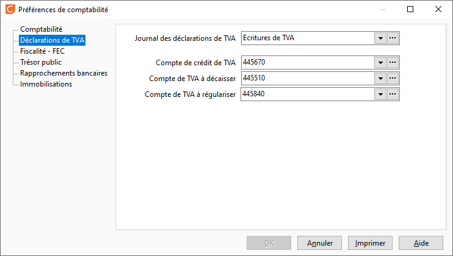

# Déclarations de TVA

## Journal des déclarations de TVA

Permet de préciser le journal dans lequel seront générées les écritures 
 provenant de la comptabilisation de la déclaration de TVA.

 

Ce journal est obligatoirement de type OD.

 

Remarque : les écritures (autres que celles de la TVA) saisies dans 
 ce journal ne seront pas prises en compte dans les déclarations de TVA.

## Compte de crédit de TVA, de TVA à décaisser, de TVA à régulariser

Les comptes saisis dans ces préférences permettent de réaliser l’écriture 
 de TVA lors de la demande de comptabilisation d'une déclaration de TVA.

