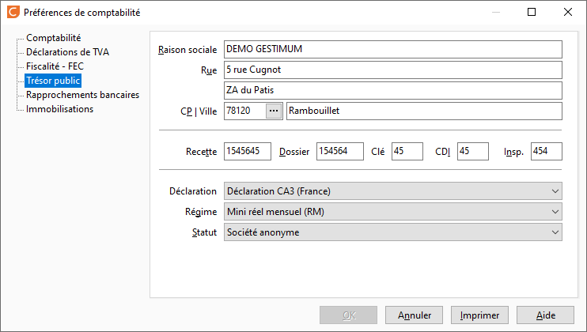

# Trésor Public

 

Les informations à y renseigner sont :

* la raison sociale du trésor public
* l'adresse complète du trésor public
* les numéros de Recette, Dossier, Clé, CDI, Insp
* le type de déclaration
* le régime de déclaration
* le statut de l’entreprise

 

 

A renseigner obligatoirement pour la réalisation et l’édition de la déclaration de TVA.

