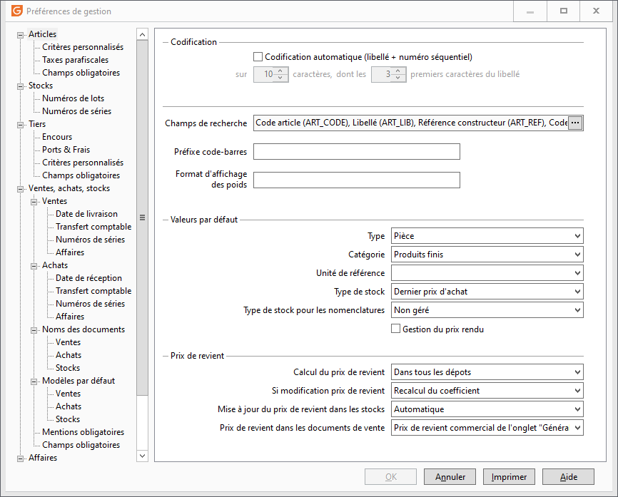

Articles

# Codification de l'article

Il est possible de gérer une codification manuelle ou automatique.

 

Pour la codification automatique, il faut indiquer la longueur du code article (entre 6 et 30) et la longueur du préfixe (nombre de caractères pris sur la désignation).

 

Par exemple une codification : 8 et 2 donnera un code sur 8 caractères commençant par les deux premiers caractères de la désignation.

# Champs de recherche de l'article

En saisie d'un article dans un document, une recherche automatique s’effectue lorsque vous saisissez des caractères dans une zone Article. Cette recherche s’effectue sur tous les champs définis ici du premier au dernier.

 

Les champs de recherche disponibles sont : le code, le libellé court, la référence constructeur et le code à barres.

 

Le bouton  permet de sélectionner ou de supprimer un champ de recherche. Placez le champ de recherche le plus courant en premier (avec un drag and drop).

 

Si la recherche sur un de ces champs est inutile, il est vivement conseillé de le supprimer afin d’accélérer la recherche.

# Préfixe "code-barre"

Un champ codifié sur 6 caractères est utilisé comme préfixe commun à tous les codes barres articles paramétrés dans les fiches.

 

Par exemple : Si le préfixe est codifié comme ABC et le code article contient un code barres 12345678. Le code-barre de l'article sera interprété comme ABC12345678.

 

Ce champ est également utilisé lors des importations des fichiers EDI qui contiennent dans certains cas seulement le suffixe du code-barre.

# Format d'affichage des poids

 

Permet d'afficher les valeurs avec un format spécifique.

# Valeurs par défaut

Ces paramètres seront par défaut appliqués en création d'une fiche famille, sous-famille et article :

 

* Type d'article par défaut (par défaut "Pièce")
* Catégorie par défaut (par défaut "Produits Finis")
* Unité de référence par défaut. Cette unité de référence (par défaut Unité) sera automatiquement proposée en création de la fiche article, comme unité de conditionnement commune à tous les conditionnements. La liste déroulante propose des unités de conditionnement qui peuvent être complétées à partir des tables de la société. Exemple : un commerçant qui gère principalement des boissons pourra par exemple, sélectionner l’unité Litre.
* Type de stock par défaut : Non géré, Valorisé, Prix moyen pondéré "PMP", Dernier prix d'achat "DPA", Prix moyen d'achat "PMA",FIFO, LIFO
* Type de stock par défaut des nomenclatures : Non géré, Valorisé, Prix moyen pondéré "PMP", Dernier prix d'achat "DPA", Prix moyen d'achat "PMA",FIFO, LIFO

 

Remarque : Les articles de type forfait sont par défaut "Non gérés en stock".

# Gestion du prix rendu

Option à cocher pour gérer le prix rendu.

 

En facturation classique, le prix de vente de base est égal au prix commercial. En gestion du prix rendu, le prix de vente commercial est égal au prix de vente de base augmenté des frais rendus (par exemple des frais de containers répartis sur chaque article).

# Paramétrage du prix de revient par défaut

## Calcul du prix de revient

Le champ du PUMP article sera alimenté suivant l’option choisie. Quatre types sont disponibles :

* Manuelle,
* Sur le dépôt principal,
* Sur tous les dépôts,
* à Partir du dernier mvt d'entrée.

## Entraînant la modification du

La modification du prix de revient entraînera une modification :

* Du prix de vente,
* Du coefficient.

## Mise à jour dans les stocks

La mise à jour dans les stocks du prix de revient (STK\_P\_PRV) peut être :

* Automatique,
* Manuelle.

## Sélection du prix de revient

La sélection du prix de revient qui figurera dans les documents ou/et les statistiques se réalise en fonction:

* De l'onglet général, (de l'article),
* De l'onglet stock. (Du stock).

## Paramétrage par défaut des préférences pour les nouvelles sociétés

Mise à jour du prix de revient  => Sur le dépôt principal,

Entraînant la modification du  => Coefficient,

Mise à jour dans les stocks  => Automatique,

Sélection du prix de revient  => Du stock.

# Â

