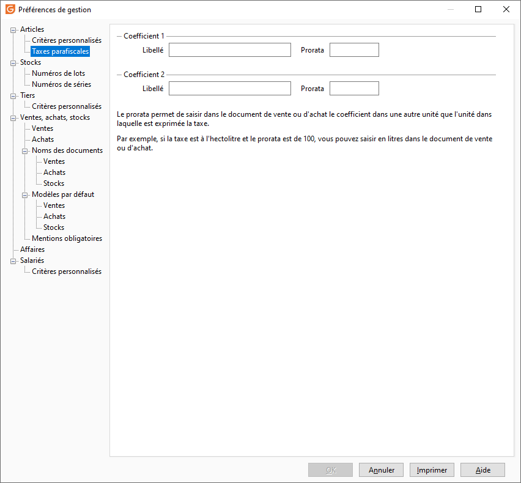

# Taxes parafiscales

 

## TPF quantité (onglet taxes parafiscales)

Ces paramètres sont destinés à l'utilisation de taxes complémentaires comme les taxes sur les alcools.

 

La création de ces champs permet d’identifier plus clairement les données concernant les taxes et laisser en plus le libre choix à l’utilisateur d’utiliser la terminologie souhaitée :

* Zone de saisie 1 et zone de saisie 2 : Le libellé saisi correspondra à la description qui sera affichée dans la Fiche article/ onglet Compta/ TPF quantité 1 et TPF quantité 2, ainsi que dans le libellé des formules des natures comptables onglet TPF
* Prorata zone 1, / prorata zone 2 : Ces deux champs permettront de définir un prorata des zones de saisies complémentaires TPF de la fiche article. Ce champ vous permettra d’utiliser directement le taux dans le paramétrage de la fiche article

 

Par exemple : 3,40 Euros par hectolitre pour les Vins tranquilles. Le prorata sera utilisé lors du calcul de la taxe dans les documents et nous obtiendrons dans ce cas d’un prorata de 100 et une taxe TPF2 de 3,40 la valeur de 3. 40/100=0. 034 €

