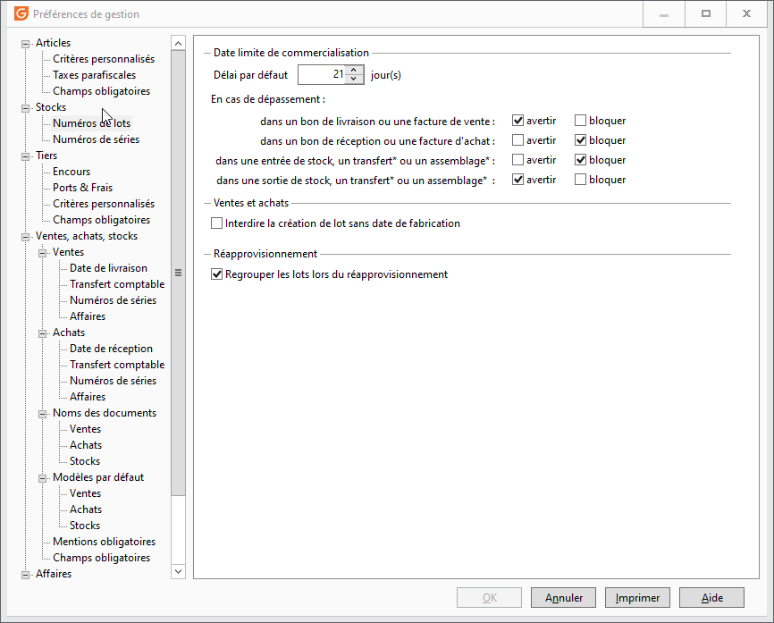

Numéros de lots

# Délai de commercialisation par défaut

La saisie du délai de commercialisation permet à chaque création de famille, sous famille ou article périssable de déterminer de façon générale celui-ci.

# Message d'avertissement ou de blocage

En cas de dépassement de la date limite de commercialisation, vous pouvez indiquer en fonction du type de document un message d'avertissement ou un message bloquant.

# Message d’avertissement

Il vous informe que l’article sélectionné est périmé. Vous pouvez confirmer la saisie de celui-ci et enregistrer le document.

# Message bloquant

Il vous informe que l’article sélectionné est périmé. Vous ne pourrez enregistrer le document que si vous changez d’article (de n° de lot).

Types de documents avec message d’avertissement ou bloquant pour les articles de type ‘lot’ périmés.

### Document de ventes

Les documents concernés sont les :

* Bons de livraison,
* Factures.

### Documents d'achats

Les documents concernés sont les :

* Bons de réception,
* Factures.

### Document de stock

#### Entrées de stock

Les documents concernés sont les :

* Bons d’entrée,
* Transferts de dépôt à dépôt pour le dépôt de destination,
* L’assemblage pour l’article composé.

#### Sorties de stock

Les documents concernés sont les :

* Bons de sorties,
* Transferts de dépôt à dépôt pour le dépôt d’origine,
* L’assemblage pour l’article composant.

# Interdire la création de lot sans date de fabrication

Cette option permet de forcer la saisie de la date de fabrication pour tous les nouveaux numéros de lot.

# Réapprovisionnement : regroupement par lots

Cette option permet lors du réapprovisionnement de prendre en compte toutes les lignes de stock d’un article précis (ayant ou non un n° de lot défini) pour calculer le stock réel et afin d’avoir un besoin général.

