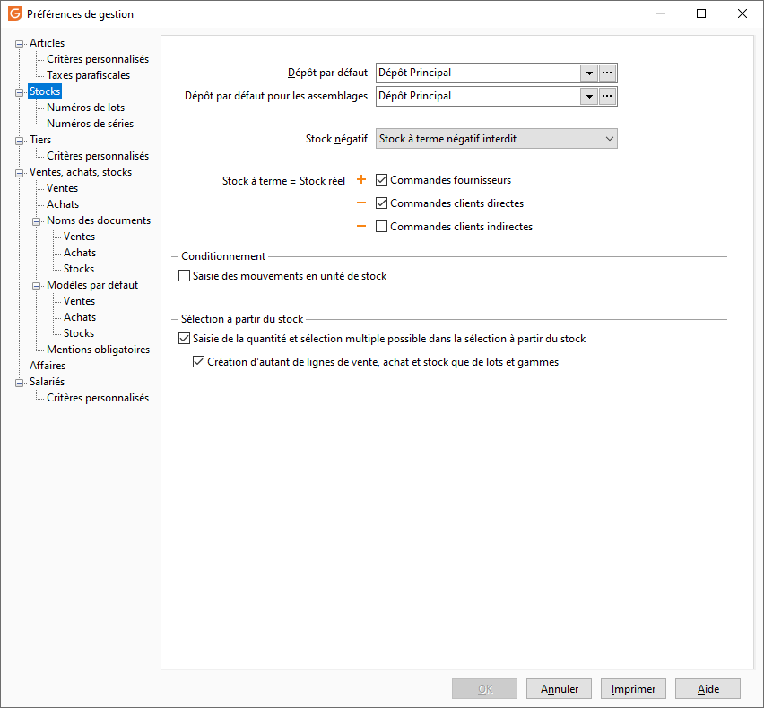

# Stocks

## Dépôt par défaut

Le Dépôt Principal proposé correspond à l'unique et indispensable dépôt disponible en création d'un dossier. Pour gérer plusieurs stocks, la création de plusieurs dépôts s’impose et il est bien entendu possible de modifier le nom du dépôt principal. Le dépôt principal sert également pour le réapprovisionnement.

### Dépôt d'assemblage par défaut

Cette option permet d’initialiser un dépôt par défaut lors de la création d’une fiche d’assemblage. Elle sera initialisée avec le dépôt principal.

## Gestion du stock négatif

* Stock négatif autorisé : A sélectionner uniquement si aucune gestion de stock n’est tenue. Permet alors d’autoriser la vente même si le stock réel et/ou à terme est négatif,
* Stock réel négatif interdit : autorise la gestion du stock à terme négatif mais pas du stock réel négatif,
* Stock à terme négatif interdit : n’autorise aucun stock négatif.

## Calcul du stock à terme

 

Vous pouvez inclure ou exclure les éléments suivants qui seront utilisés pour le calcul du stock à terme :

* les commandes fournisseurs,
* les commandes clients directes,
* les commandes clients indirectes (pour les articles composants de nomenclature).

## Saisie en unité de stock

Par défaut, le logiciel propose d'enregistrer les mouvements de stock (entrées, sorties, transfert, .. ) En unité de stock mais il est possible de choisir l'unité de vente (case décochée).

## Sélection multiple de numéros de lot ou de gamme

L'option "Saisi de la quantité et sélection multiple possible dans la sélection à partir du stock" permet de sélectionner n numéros de lot dans la saisie d'un document d'achat ou de vente. Cela permet d'avoir une seule ligne d'article pour n numéros de lot.

 

L'option "Création d'autant de lignes de vente, achat et stock que de lots et gammes" permet de créer autant de lignes que numéros de lot ou gammes sélectionnés. Elle est dégrisée en fonction de l'option précédente.

