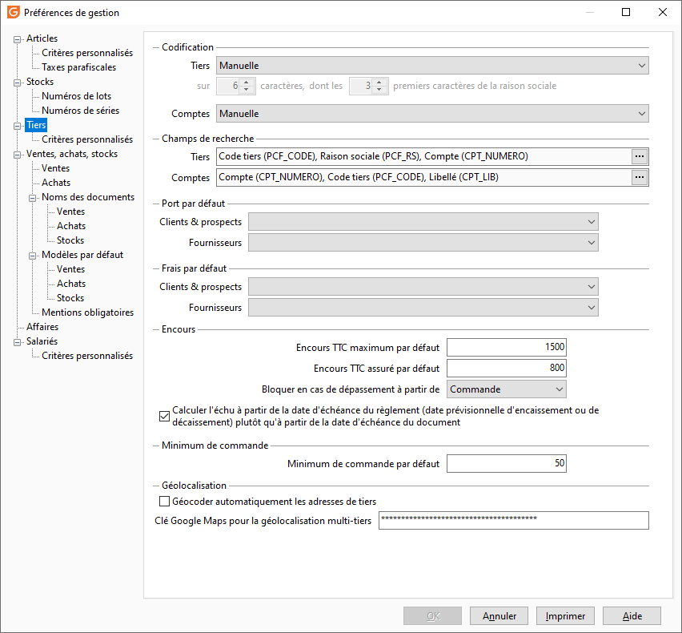
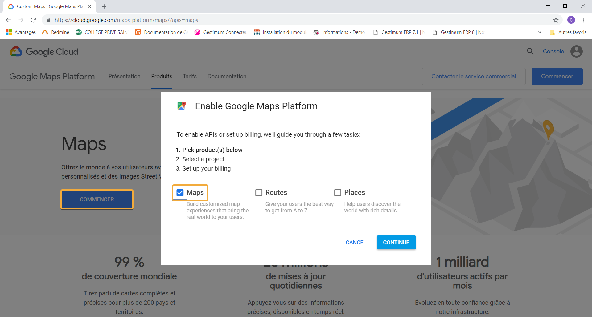

Tiers

# Codification des tiers

Il est possible de gérer une codification manuelle ou automatique.

 

En codification automatique, il faut indiquer la longueur du code tiers (entre 6 et 15) et la longueur du préfixe (nombre de caractères pris sur la raison sociale). Par exemple une codification : 8 et 2 donnera un code tiers sur 8 caractères commençant par les deux premiers caractères de la raison sociale.

# Compte comptable

Les comptes comptables de tiers peuvent être générés suivant plusieurs principes :

* En "Manuelle", le compte proposé est la racine de compte suivie du code client. Ce numéro reste modifiable,
* Automatique selon 3 possibilité :
* + La racine de compte + un numéro interne,
	+ La racine du compte + un numéro séquentiel,
	+ La racine du compte + numéro d'ordre dans l'alphabet de la première lettre de la raison sociale du tiers (sur 2 caractères : 01 si la raison sociale commence par A, 02 par B, ..., 26 par Z) + un numéro séquentiel.

# Champs de recherche d'un tiers ou d'un compte comptable

La recherche d’un tiers est automatique lorsque vous saisissez des caractères dans une zone Clients, Fournisseurs.

 

Cette recherche s’effectue sur tous les champs définis ici :

* Les champs de recherche disponibles pour les Tiers sont : le code, la raison sociale et le numéro de compte,
* Les champs de recherche disponibles pour les comptes comptables sont : le code Tiers associé au compte, l’intitulé du compte et le numéro du compte.

 

Le bouton  permet de sélectionner ou de supprimer un champ de recherche. Placez le champ de recherche le plus courant en premier (avec un drag and drop).

 

Si la recherche sur un de ces champs est inutile, il est vivement conseillé de le supprimer afin d’accélérer la recherche.

# Port et frais par défaut

Les frais de port et les frais par défaut seront automatiquement proposés en création d'une nouvelle fiche de tiers. Les [ports et les frais](../../Frais/2/Frais.htm) sont à définir à partir de la commande Frais du menu SOCIETE.

# Encours maximum

## Encours maximum par défaut

C'est le montant de créance assuré + le montant de créance autorisé pour chaque client.

## Encours assuré par défaut

C'est le montant de créance maximale géré par un organisme assureur.

## Bloquer en cas de dépassement à partir de

Cette option permet de bloquer la saisie des documents des tiers ayant atteint le montant maximum calculé à partir de l'option Encours maximum.

Ce blocage peut être effectué à partir des documents suivants :

* Devis ou,
* Accusé de réception ou,
* Bon de livraison ou,
* Facture.

## Encours calculé sur la date d'échéance du règlement

Lorsque l’option est cochée, la mise à jour de l’encours des tiers (disponible dans la fiche client) est effectuée à la date d’échéance du règlement sinon (pas de sélection de l’option) la mise à jour de l’encours des tiers est effectuée sur la date d'échéance du document.

# Minimum de commande par défaut

La saisie d'un minimum de commande permet d'obtenir un avertissement lors de la réalisation d’un accusé de réception dont le montant de commande est inférieur à ce minimum. Permet d’ajouter des frais.

# Géocoder automatiquement les adresses de tiers

Lors de l'enregistrement d'une adresse, Gestimum recherche la latitude et la longitude de l'adresse qui est en cours de saisie et s'en sert par la suite pour la géolocalisation des tiers. Si cette option n'est pas cochée, Gestimum ne fera pas cette recherche et la géolocalisation sera plus longue.

# Géolocalisation multi-tiers

La zone de saisie 'Clé Google Maps pour la géolocalisation multi-tiers', permet d'utiliser l'API Javascript Google Maps depuis l'ERP.

Vous pouvez vous procurer une clé API Javascript, depuis le site de Google <https://cloud.google.com/maps-platform/maps/> .

 

Cliquez sur 'Commencer', puis cochez Maps dans la fenêtre de sélection :

 

 

Puis suivez les instructions, jusqu'à la génération de la clé API Javascript. Un compte de facturation Google sera nécessaire.

 

Attention ! Depuis le 16 juillet 2018, l'utilisation des API de la plate-forme  Google Maps est devenu payante. Google Maps Platform vous offre 200 $ d'utilisation mensuelle, au delà une facturation sera effectuée. Vous pouvez définir des plafonds d'utilisation pour faire en sorte de ne pas dépasser ce montant.

 

 

 

