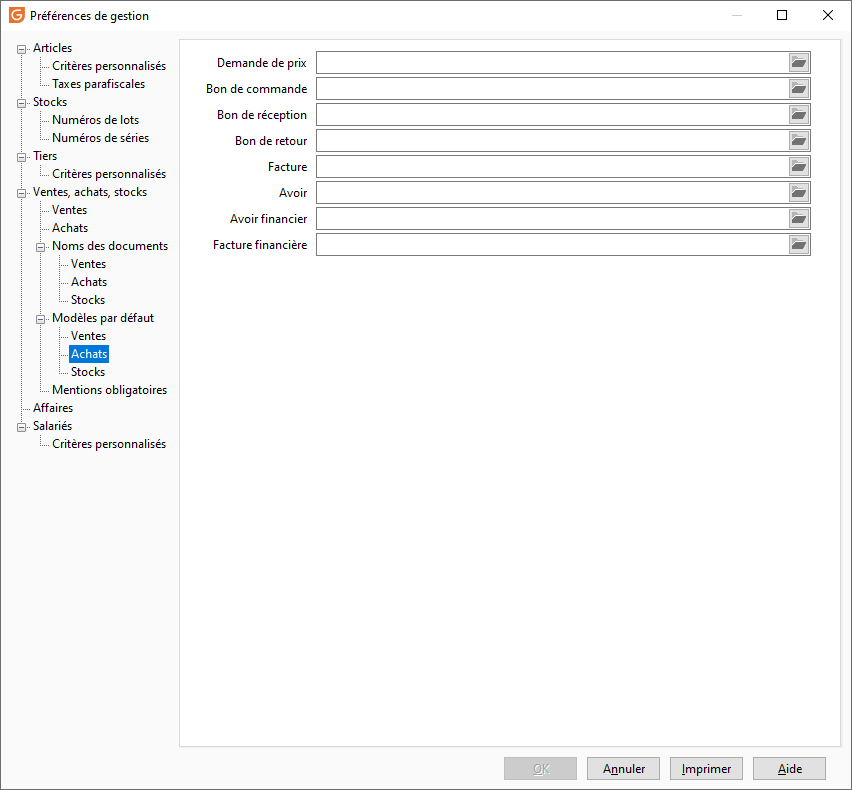

# Achats

Les modèles des documents d’achats sont paramétrés par défaut dans cet onglet.

 

 

Il vous est possible de définir les modèles suivants :

* Demande de prix
* Commande fournisseur
* Bon de Réception
* Bon de Retour
* Facture
* Facture financière
* Avoir
* Avoir Financier

 

 

