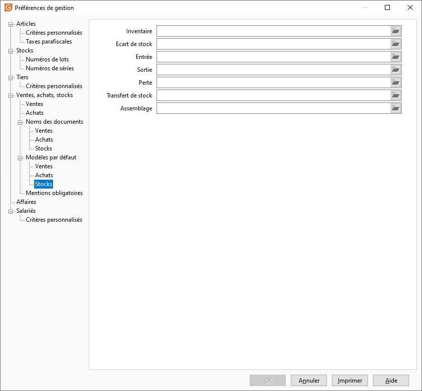

# Stocks

Les modèles des documents de stocks sont paramétrés par défaut dans cet onglet.

 

 

Il vous est possible de définir les modèles suivants :

* Inventaires
* Écarts de stock
* Entrées
* Sorties
* Pertes
* Transferts de dépôts
* Assemblages

 

 

