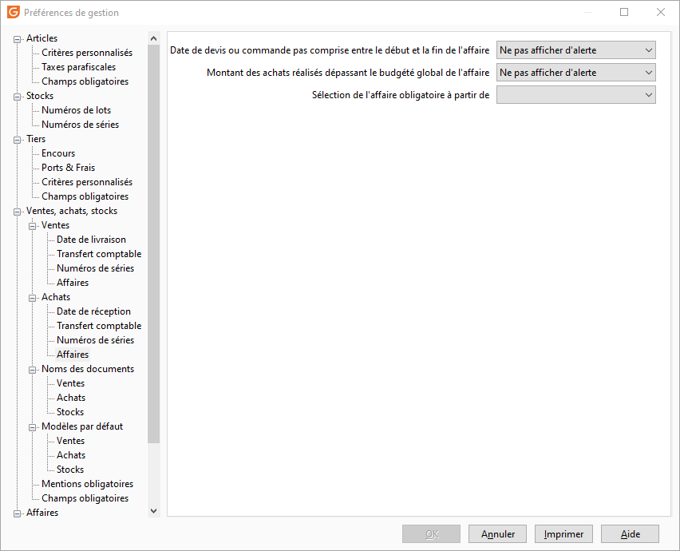

# Achats

## 

### Sous-type de document par défaut

En création d'un document, le curseur sera prépositionné sur le type de document sélectionné ici.

### Modification interdite si

Par défaut, un document reste modifiable tant qu'il n'a pas été Comptabilisé. Un autre état peut toutefois être sélectionné dans la liste déroulante : Imprimé, Réglé.

### En HT ou TTC par défaut

Choisir le mode de facturation par défaut. Les prix d’achat doivent correspondre au mode de facturation indiqué (Prix d’achat HT ou Prix d’achat TTC).

 

En facturation TTC, le logiciel calcule en pied de document un Total TTC réel, c'est à dire que la TVA est calculée à partir de ce dernier (TTC dont TVA). Il sera ponctuellement possible de réaliser des documents dans un autre mode, mais dans ce cas, le prix des articles pourra être recalculé automatiquement (voir l’option Recalculer les lignes).

 

Des différences peuvent en effet apparaître si le calcul du prix s’effectue à partir de la base HT ou de la base TTC.

### Masquer les articles interdits à l'achat dans les documents d'achat

En activant cette option, les articles définis comme interdits à l'achat ne seront plus proposés dans le menu déroulant de la grille de saisie des documents d'achat.

### Réappliquer automatiquement les grilles de tarifs et promotions lors de l'enregistrement du document en cumulant les quantités par articles

Cette option est associée à l'application de grilles de tarifs et promotions quantitatives (avec seuil) sur les quantités cumulés par code article dans un document.

 

Si cette option est cochée, lors de l’enregistrement du document le cumul de quantités et l’application de la grille ou promotion correspondante seront automatiquement effectués.

 

### Alerte en fonction des budgets

Selon la gestion des budgets dans le module affaires, le seuil d'alerte détermine le montant de budget atteint, et blocage sur dépassement permet d'interdire une commande hors budget.

## Achat|Date de réception

## 

### Date de réception modifiable

Cette option permet de mettre à jour les date de livraison au document et à la ligne de document dans les Bons de réception et factures qui ne sont pas à un statut transféré ou comptabilisé.

### Exprimer la date de réception en semaine

Dans une pièce "Demande de prix" ou "Bon de commande", la sélection de la date de réception prévue se réalise en semaine.

### Mise à jour des dates de réception des lignes de commandes à partir de la date prévue

Dans une commande, la date de réception prévue est calculée en fonction de la sélection ou non de l’option :

* Que l’option soit cochée ou non, l’initialisation de la Date de réception prévue en entête est la Date de la pièce + le Délai de réception des préférences de la gestion. Celle de la Date de réception en ligne est la Date de la pièce + le délai maximum entre le délai de réception des préférences et celui de la fiche article,
* Si l’option n’est pas cochée,lors de la modification de la Date de réception en ligne, si celle-ci est supérieure à la Date de réception prévue en entête, alors la Date prévue en entête est égale à la Date de réception en ligne,
* Si l’option est cochée,lors de la modification de la Date prévue, alors la Date de réception en ligne est égale au maximum entre la [Date de la pièce + (le maximum entre le Délai de réception des préférences et celui de la fiche article )], et la Date de réception prévue.

### Délai de réception

Ce nombre de jours servira à calculer la date prévue de réception par défaut en entête des commandes d’achats (c'est la marge de sécurité par défaut).

## Achat|Transfert comptable

## 

### 3 Options sont disponibles et sont cumulatives (elles ne sont pas activées par défaut) :

* Transférer en comptabilité l'analytique paramétrée dans les natures comptables de l'article ou des natures de base : permet de transférer les écritures analytiques d’achats en comptabilité en fonction des sections analytiques renseignées sur les natures comptables de base ou personnalisées des articles, frais de port, autres frais …
* Transférer en comptabilité l'analytique paramétrée du plan comptable : permet de transférer les écritures analytiques d’achats en comptabilité en fonction de la répartition des sections analytiques paramétrées dans les comptes du plan comptable général
* Transférer en comptabilité l'analytique de l'affaire (nécessite d'avoir activé le module affaires) : permet de tranférer en comptabilité, l'analytique de l'affaire à la ligne de document d'achat ou au document.

 

Dans le cas où les 3 options sont activées, la remontée du paramétrage de l'analytique se fera comme suit :

1. Si les lignes de documents comportent un code affaire => c'est la section analytique de l'affaire de chaque ligne, qui sera imputée au compte de charge de la nature comptable de l'article associé
2. S'il n'y a pas de code affaire à la ligne, on ira chercher le paramétrage analytique de la nature comptable de l'article ou des natures de base
3. S'il n'y a pas de paramétrage analytique dans les natures, alors c'est la paramétrage du compte comptable qui sera reprise.

## Achat|Numéros de séries

## 

### Réservation des numéros de série à partir de

Vous avez la possibilité de réserver les n° de série avant les bons de réceptions :

* Demandes,
* Commandes

 

Dans les documents d’achats, le "clic droit" N° de série est possible (dégrisé).

### Affectation par défaut des numéros de série à partir de

Vous avez la possibilité de'affecter les numéro de série dans les documents d'achat de type :

* Demande de prix
* Bon de commande
* Bon de réception
* Bon de retour
* Facture
* Avoir

L’affectation automatique des numéros de série est facultative.

## Achat|Affaires

### Date de devis ou commande pas comprise entre le début et la fin de l'affaire

Cet option permet de contrôler que la date du document d'achat affecté à l'affaire est bien comprise entre la date début et la date de fin paramétrées dans l'affaire. En fonction de l'option selectionée, cela affichera une alerte (bloquante ou pas) à l'affectation de l'affaire à un devis ou une commande et que la date de ce document est en dehors des périodes de l'affaire.

### Montant des achats réalisés dépassant le budgété global de l'affaire

Cet option permet de contrôler que le montant des achats réalisés afféctés à l'affaire, ne dépasse pas son montant global budgété. En fonction de l'option selectionée, cela affichera une alerte (bloquante ou pas) à l'affectation de l'affaire sur le document.

### Sélection de l'affaire obligatoire à partir deÂ

Permet de rendre oblifatoire, la saisie du code affaire sur un document à partir d'un sous type de document choisi.

 

