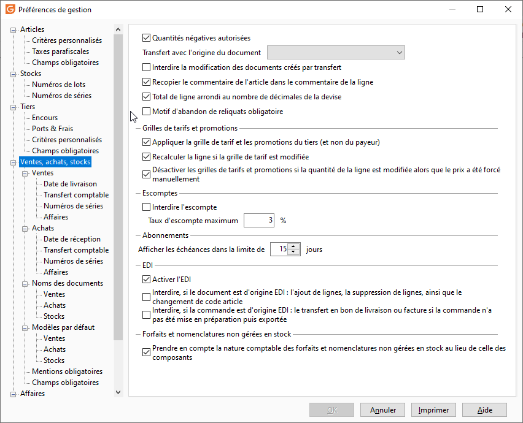

Ventes, achats, stocks

# Quantités négatives autorisées

Cette option autorise l'enregistrement des lignes d'articles avec saisie d'une quantité en négatif (retour marchandises). Cette option est généralement demandée lorsqu’aucune gestion de stock n'est tenue. En gestion de stock, un retour passera par la réalisation d'un bon de retour (qui pourra être valorisé en mode PMP).

# Transfert avec origine du document

Cette option génère sur le document, une ligne de commentaire pouvant indiquer différents éléments en fonction du choix effectué. Plusieurs options sont à votre disposition dans le menu déroulant :

* Aucun
* R√©f√©rence¬
* N° de pièce / Date
* N° de pièce / Date / Référence

 

Lorsqu’un libellé/type de document est présent dans la fiche du Pays de l’adresse de facturation du document d’origine, la ligne de commentaire générée prend en compte ce libellé.

 

Si la référence n'est pas renseignée dans le document d'origine on obtient une ligne de commentaire de type "Réf. ".

 

Lors d'un regroupement de documents par payeur, avec une option de transfert avec origine du document, différente de "Aucun", le code tiers et la raison sociale du client seront ajoutés en fin de ligne de commentaire.

# Interdire la modification des documents créés par transfert

Fige les documents créés par transfert.

# Recopier le commentaire de l'article dans les lignes

Permet de récupérer un commentaire article (saisi dans l’onglet "Infos"de la fiche article) dans un document.

# Total de ligne arrondi au nombre de décimales de la devise

Par défaut, le logiciel fait un arrondi à 2 décimales. L'activation de cette option va permettre d'utiliser le paramétrage des devises pour gérer les arrondis dans les documents en fonction du nombre de décimales de la devise. Les éléments suivants seront alors impactés :

* le total de la ligne
* le montant TTC
* le montant Net
* le montant de l'échéance du document

Ce paramètre est également utilisé dans le cas où la case "En TTC" est cochée. C'est alors le montant brut de la ligne qui sera arrondi à la décimale de la devise. Le montant brut du document étant la somme du montant total de chaque ligne.

# Motif d'abandon des reliquats obligatoire

Oblige l'utilisateur à sélectionner un motif d'abandon des reliquat. Les motifs sont paramétrables dans les tables de référence.

# Appliquer la grille de tarifs et les promotions du Tiers (et non du payeur)

Permet, lors de la facturation, d’appliquer la grille de tarif ou Promotion figurant sur la fiche du tiers livré et non la grille de tarif du payeur affecté à la facture de ce tiers.

# Recalculer les lignes si la grille de tarifs est modifiée

Lorsque cette option est cochée, le recalcul des lignes du document s’effectuera automatiquement lors de la modification de la grille de tarifs dans l'onglet entête du document. Ce recalcul prend en compte la promotion en cours, la grille de tarifs et le tarif de la fiche article.

# Désactiver les grilles de tarifs et promotions si la quantité de la ligne est modifiée alors que le prix a été forcé manuellement

 

Lorsque cette option est cochée, si le prix saisi dans la ligne du document est différent du prix applicable par défaut (prix présent dans l'article, grille de tarif, promotion), lors de la modification de la quantité de la ligne, le prix ne sera pas actualisé.

# Escomptes

* Interdire l'escompte : lorsque cette option est cochée, l'utilisation de l'escompte est interdite sur l'ensemble du dossier et pour tous les utilisateurs quelque soit leur profil
* Taux d'escompte maximum : ce taux correspond au taux d'escompte sur facture et/ou règlement. Lors d'un écart de règlement, le logiciel pourra automatiquement mettre en escompte cet écart si sa valeur correspond. En réalisation de facture, ce taux sera le taux maximum d'escompte financier applicable.

# Abonnements

Ce nombre de jours permet de limiter les échéances d’abonnements en Facturation des abonnements du menu Ventes, à celles arrivant à terme dans les x jours à partir du jour courant.

# EDI

Les options à cocher suivantes sont utilisées dans la Gestion des documents EDI

* Activer l'EDI : Cette option permet l’accès au menu EDI (Outils/Import/Solutions partenaires, menu contextuel EDI dans la liste des documents, et les états " En préparation EDI et Exporté EDI " dans la liste des documents de vente, la possibilité de transférer un document
* Interdire, si le document est d'origine EDI : l'ajout de lignes, la suppression de lignes, ainsi que le changement de code article
* Interdire, si la commande est d'origine EDI : le transfert en bon de livraison ou facture si la commande n'a pas été mise en préparation puis exportée

# Forfaits et nomenclatures non gérées en stock

## Prendre en compte la nature comptable des forfaits et nomenclature non gérées en stock au lieu de celle des composants

Quand cette option n'est pas cochée, Gestimum utilise les paramétrages (natures comptables, prix de vente et d'achat) des composants de nomenclature non gérées en stock et forfait pour :

* faire les calculs dans les documents d'achat et de vente (TVA, TPF),
* affecter les comptes lors du transfert comptable.

 

A l'inverse quand elle est cochée, Gestimum utilisera le paramétrage de l'article principal.

 

 

