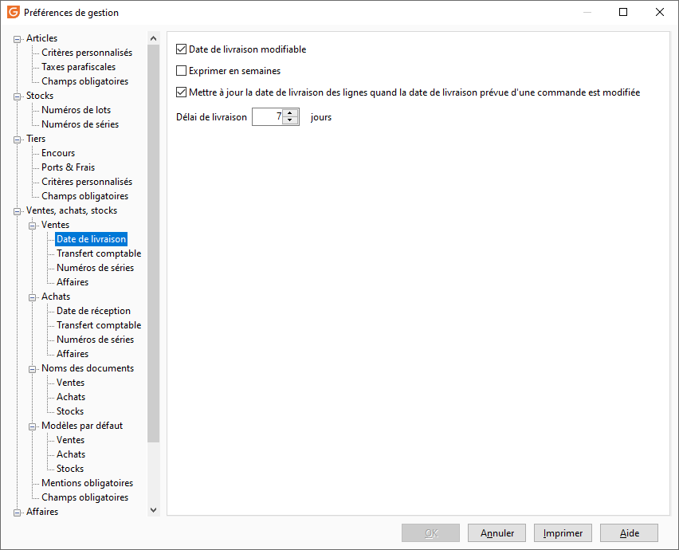
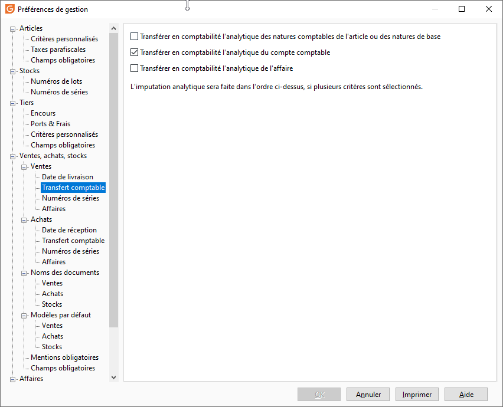
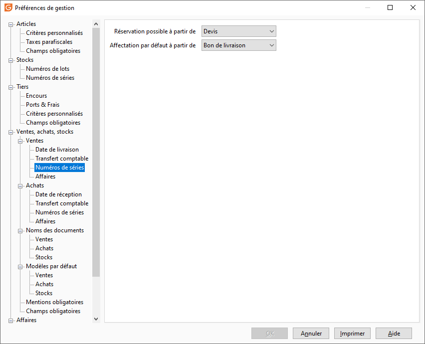
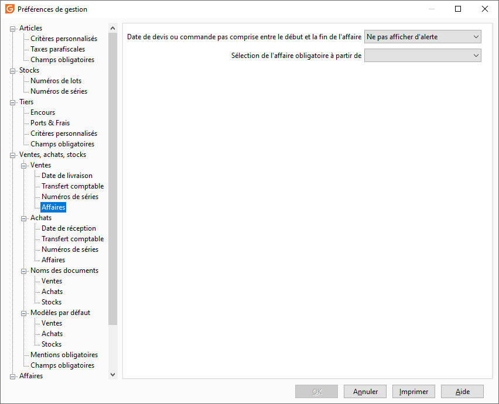

# Ventes

## 

### Sous-type de document par défaut

En création d'un document, le curseur sera positionné sur le type de document sélectionné ici.

### Modification interdite si

Par défaut, un document reste modifiable tant qu'il n'a pas été Comptabilisé. Un autre état peut toutefois être sélectionné dans la liste déroulante: Imprimé, Réglé.

### En HT ou TTC par défaut

Choisir le mode de facturation par défaut. Les prix de vente doivent correspondre au mode de facturation indiqué (Prix de vente HT ou Prix de vente TTC).

 

En facturation TTC, le logiciel calcule en pied de document un Total TTC réel, c'est à dire que la TVA est calculée à partir de ce dernier (TTC dont TVA). Il sera ponctuellement possible de réaliser des documents dans un autre mode, mais dans ce cas, le prix des articles pourra être recalculé automatiquement (voir l’option Recalculer les lignes).

 

Des différences peuvent en effet apparaître si le calcul du prix s’effectue à partir de la base HT ou de la base TTC.

### Documents avec contrôle de la référence article

Ce contrôle peut s'appliquer sur le devis uniquement ou sur tous les documents de vente à l'exception des devis. Une ligne d'article pourra ainsi être composée :

* D'un code article qui existe dans la base article (option sélectionnée),
* D'un code article qui n'existe pas dans la base article (option non sélectionnée, pas de contrôle).

### Masquer les articles interdits à la vente dans les documents de vente

En activant cette option, les articles définis comme interdits à la vente ne seront plus proposés dans le menu déroulant de la grille de saisie des documents de vente.

### Prix de revient modifiable

Si l’option Prix de revient modifiable est cochée alors le prix de revient peut être modifié directement dans les documents (champ LIG\_P\_PRV). Cette modification n’a aucune incidence sur le stock et le calcul du prix de revient. Elle peut être utilisée lors de la facturation d’article non géré en stock afin d’obtenir une marge correcte.

### Mise à jour du prix de revient à la livraison

Le transfert de document n’entraîne pas le changement du prix de revient des articles si celui-ci a été modifié (entrée en stock de l’article, inventaire…) depuis la création du document d’origine. Toutefois, le fait de cocher cette option entraînera la mise à jour du prix de revient dès la livraison.

### Avertir si le prix de revient est supérieur au prix de vente

Message d'avertissement affiché si le prix de revient de la ligne du document est supérieur au prix de vente de la ligne.

### Réappliquer automatiquement les grilles de tarifs et promotions lors de l'enregistrement du document en cumulant les quantités par article

Cette option est associée à l'application de grilles de tarifs et promotions quantitatives (avec seuil) sur les quantités cumulés par code article dans un document.

 

Si cette option est cochée, lors de l’enregistrement du document le cumul de quantités et l’application de la grille ou promotion correspondante seront automatiquement effectués

## Ventes|Date de livraison

### Date de livraison modifiable

Cette option permet de mettre à jour les date de livraison au document et à la ligne de document dans les Bons de livraisons et factures qui ne sont pas à un statut transféré ou comptabilisé.

### Exprimer la date de livraison en semaine

Dans une pièce Pro-Forma ou Devis ou Accusé réception, la sélection de la date de livraison prévue se réalise en semaine.

### Mettre à jour des dates de livraison des lignes lorsque la date de livraison prévue d'un accusé de réception est modifiée

Dans un accusé réception, la date de livraison prévue est calculée en fonction de la sélection ou non de l’option :

* Que l’option soit cochée ou non, l’initialisation de la Date de livraison prévue en entête est la Date de la pièce + le Délai de livraison des préférences de la gestion. Celle de la Date de livraison en ligne est la Date de la pièce + le délai maximum entre le délai de livraison des préférences et celui de la fiche article,
* Si l’option n’est pas cochée lors de la modification de la Date de livraison en ligne, si celle-ci est supérieure à la Date de livraison prévue en entête, alors la Date prévue en entête est égale à la Date de livraison en ligne,
* Si l’option est cochée lors de la modification de la Date prévue alors la Date de livraison en ligne est égale au maximum entre la [Date de la pièce + (le maximum entre le Délai de livraison des préférences et celui de la fiche article )] et la Date de livraison prévue.

### Délai de livraison

Ce nombre de jours servira à calculer la date prévue de livraison par défaut en entête des accusés de réception (c'est la marge de sécurité par défaut).

## Ventes|Transfert comptable

### 3 Options sont disponibles et sont cumulatives (elles ne sont pas activées par défaut) :

* Transférer en comptabilité l'analytique paramétrée dans les natures comptables de l'article ou des natures de base : permet de transférer les écritures analytiques d’achats en comptabilité en fonction des sections analytiques renseignées sur les natures comptables de base ou personnalisées des articles, frais de port, autres frais …
* Transférer en comptabilité l'analytique paramétrée du plan comptable : permet de transférer les écritures analytiques d’achats en comptabilité en fonction de la répartition des sections analytiques paramétrées dans les comptes du plan comptable général
* Transférer en comptabilité l'analytique de l'affaire (nécessite d'avoir activé le module affaires) : permet de tranférer en comptabilité, l'analytique de l'affaire à la ligne de document d'achat ou au document.

 

Dans le cas où les 3 options sont activées, la remontée du paramétrage de l'analytique se fera comme suit :

1. Si les lignes de documents comportent un code affaire => c'est la section analytique de l'affaire de chaque ligne, qui sera imputée au compte de charge de la nature comptable de l'article associé
2. S'il n'y a pas de code affaire à la ligne, on ira chercher le paramétrage analytique de la nature comptable de l'article ou des natures de base
3. S'il n'y a pas de paramétrage analytique dans les natures, alors c'est la paramétrage du compte comptable qui sera reprise.

## Ventes|Numéros de séries

### Réservation possible des numéros de série à partir de

Vous avez la possibilité de réserver les n° de série avant les bons de réceptions/livraisons :

* Pro-Forma,
* Devis,
* Accusés de réception.

 

Dans les documents de ventes, le clic droit N° de série est possible (dégrisé).

### Affectation par défaut des numéros de série à partir de

L’affectation automatique des numéros de série est facultative sur les documents : Pro-forma, devis, commande, bon de livraison, bon de retour, facture, avoir.

## Ventes|Affaires

### Date de devis ou commande pas comprise entre le début et la fin de l'affaire

Cet option permet de contrôler que la date du document de vente affecté à l'affaire est bien comprise entre la date début et la date de fin paramétrées dans l'affaire. En fonction de l'option sélectionnée cela affichera une alerte (bloquante ou pas) l'affectation de l'affaire à un devis ou une commande et que la date de ce document est en dehors des périodes de l'affaire.

### Sélection de l'affaire obligatoire à partir deÂ

Permet de rendre obligatoire, la saisie du code affaire sur un document à partir d'un sous type de document choisi.

