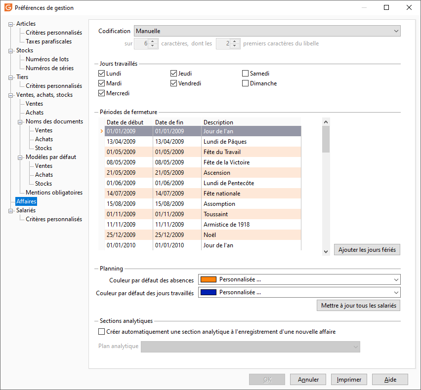

Affaires

 

Cette onglet vous permet de définir :

* la méthode de codification des affaires
* les jours de fermeture pour le planning
* les couleurs pour voir les différents jours dans le planning
* le libellé des critères des salariés
* la création de sections analytique à partir de la création des affaires

